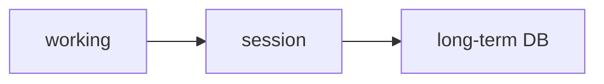

# 13: Agentic memory

After this page you can name working, short-term, long-term, and procedural memory as different stores.

## Data
- Working: this POST
- Short-term: session list
- Long-term: SQLite/vector across sessions
- Procedural: system prompt / SKILL.md
- Moved from modules/14 and leftover 01/03

## Information
Do not put all four in one file.

## Knowledge
1. Decide which store.
2. Write/read that store only.

## Wisdom
JSON session is enough until you need cross-session facts.

## The When and Why
- **When:** a fact must survive a new session.
- **Why:** the session file is not long-term memory.

## How it works

## Data contract
Fact row: `{ "key": "string", "value": "string" }`

## Lab
Private RAG lab below.

## Related
- **Chapter 05 checkpoints:** short-term persistence.

## Notes
Leftover memory from 01/03 lives here.
