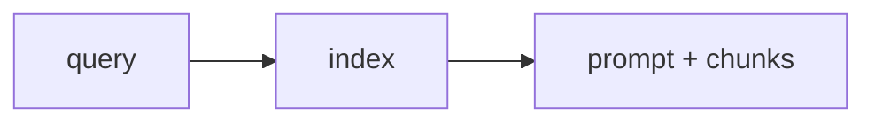

# 13: Private RAG

After this page a local index answers from your files without a cloud embed API if the lab says so.

## Data
- Lab: `lab3_local_private_rag` (from labs/07)
- Module leftover: `02_local_first_private_data` facts
- Redact PII before embed if the old lab does

## Information
Retrieve chunks, stuff into the prompt, generate.

## Knowledge
1. Index local files.
2. Query.
3. POST with the chunks.

## Wisdom
Not a hosted vector service.

## The When and Why
- **When:** the answer must come from local files.
- **Why:** the model will guess without chunks.

## How it works

## Data contract
chunk: `{ "text": "string", "source": "path" }`

## Lab
- [lab3_local_private_rag.py](./lab3_local_private_rag.py) / [lab3_local_private_rag.md](./lab3_local_private_rag.md)

## Related
- **Chapter 00 POST:** the generate step.

## Notes
Moved from labs/07 lab3 and modules/07/02.
