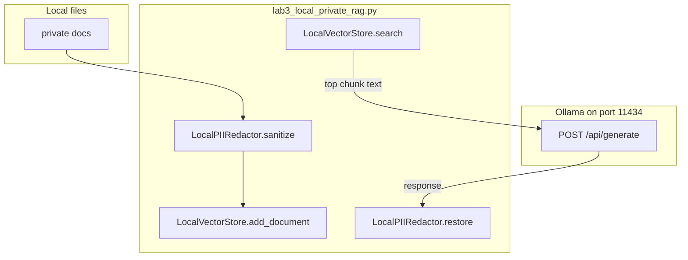

# 13: Private RAG

After this chapter a local index answers from your files. The embed and the search stay on this machine. There is no cloud embed API on this page.

## Data
**RAG** means: retrieve text chunks, put them in the prompt, then generate. The model does not see your whole corpus. It sees the chunks you stuffed into `prompt` (or into `messages`).

A **chunk** is a small piece of a local file. The intended shape is `{ "text": "string", "source": "path" }`. `text` is what goes in the prompt. `source` is the file path you can print as a citation.

An **index** is the local store of those chunks. The intended store is on disk next to the script (or in RAM for a tiny lab). Search returns the top chunks for a query.

**PII redaction** happens before you index. Emails and names become tokens such as `[EMAIL_1]` and `[PERSON_1]`. A vault dict maps token to original. After the model replies, you restore the originals in the printed string. The POST body should not contain the raw email.

The lab file is `lab3_local_private_rag.py` (moved from labs/07). Functions: `LocalPIIRedactor.sanitize`, `LocalPIIRedactor.restore`, `LocalVectorStore.add_document`, `LocalVectorStore.search`, `run_airgapped_private_rag`. Module leftover `02_local_first_private_data` is the same idea: local files, local search, local POST.

`OLLAMA_HOST` should default to `http://192.168.1.29:11434`. `OLLAMA_MODEL` should default to `qwen3.6:35b-a3b-65k`. The route is `POST /api/generate`.

## Information
Without chunks, the model guesses. With chunks, the answer can quote a local `source` path and the `text` you retrieved.

The path is: index local files, query the index, build a prompt that contains the chunks, POST, print `response`. Redact PII on the way in. Restore PII on the way out.

This is not a hosted vector service. Chroma Cloud, Pinecone, and a vendor embed API are out of scope. Chapter 00 already taught the POST. This page adds the retrieve-and-stuff step.

Compaction (`00_context_engine.md`) shrinks the `messages` list you already have. RAG adds new text from files you did not put in that list. Codebase indexing (`03_codebase_indexing.md`) is the same retrieve-and-stuff idea pointed at a repo.

## Knowledge
1. Read local files (or the lab's `private_docs` list). Split into chunks `{ "text", "source" }`.
2. Run `LocalPIIRedactor.sanitize` on each chunk `text` (and on the query) before you index.
3. Call `LocalVectorStore.add_document(doc_id, content)` for each sanitized chunk.
4. Call `LocalVectorStore.search(query)` and take the top chunks.
5. Build `prompt` as `Context: {chunk text}\nQuestion: {query}\nAnswer in 1 sentence:`.
6. POST `model`, `prompt`, `stream: false`, `options.temperature: 0.0` to `{OLLAMA_HOST}/api/generate`.
7. Read `data["response"]`. Run `LocalPIIRedactor.restore` before you print.

## Wisdom
Stop when one local chunk is in the prompt and the printed answer came from that chunk. Do not add a hosted vector service, a cloud embed API, or a codebase walker on this page. If you add them now, a wrong answer could come from the index, the redactor, or the POST.

## The When and Why
- **When:** the answer must come from local files, and those files must not leave this machine.
- **Why:** the model will guess without chunks. A cloud embed API would send the file text off-box.

## How it works



Walkthrough of one query:

1. `run_airgapped_private_rag` sanitizes each document and calls `add_document`.
2. It sanitizes the query and calls `search`. The top `content` string is the context.
3. It POSTs `{ "model": "...", "prompt": "Context: ...\\nQuestion: ...", "stream": false, "options": { "temperature": 0.0 } }` to `{OLLAMA_HOST}/api/generate`.
4. It reads `data["response"]` and runs `restore` so `[PERSON_1]` becomes the original name in the printed line.

Nothing in that walkthrough calls a cloud embed URL. The new work is retrieve, stuff, generate.

## Data contract

**Intended chunk**

```json
{ "text": "string", "source": "path" }
```

**Request** `POST /api/generate`

```json
{
  "model": "qwen3.6:35b-a3b-65k",
  "prompt": "Context: {chunk text}\\nQuestion: {query}\\nAnswer in 1 sentence:",
  "stream": false,
  "options": { "temperature": 0.0 }
}
```

**Response**

```json
{
  "response": "string"
}
```

The printed string is `restore(response)`, not the raw `response`.

## Lab
Done when a local chunk is in the prompt and the printed answer matches that chunk after PII restore.

- Module: [this file](./02_private_rag.md)
- Lab 3: [lab3_local_private_rag.py](./lab3_local_private_rag.py) / [lab3_local_private_rag.md](./lab3_local_private_rag.md) - redact, index, retrieve, POST, restore. Done when the diagnosis line is printed with the original name.

## Related
- **Chapter 00 POST:** the generate step. This page adds retrieve-and-stuff.
- **00_context_engine.md:** shrinks the list you already have. Does not read files.
- **03_codebase_indexing.md:** same retrieve idea on a repo.

## Notes
- Moved from labs/07 lab3 and modules/07/02.
- Contract drift vs `lab3_local_private_rag.py`: no `OLLAMA_HOST` / `OLLAMA_MODEL` read (URL and model are literals). Documents are hardcoded strings, not files. Store items are `{ "id", "content" }`, not `{ "text", "source" }`. `search` scores word overlap and returns the top 1 `content` string. There is no `source` path in the prompt or the printout. The intended contract is still `{ "text", "source" }` chunks from local files, then POST. Write that in your copy. Leave the reference file as-is.
