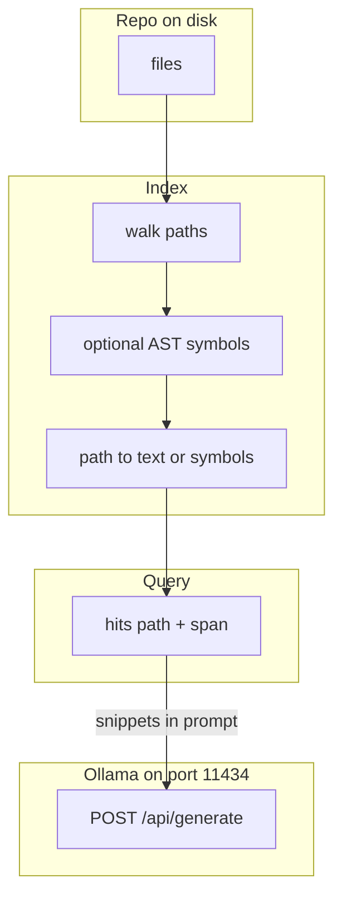

# 13: Codebase indexing

After this chapter a repo is a tree of files plus an optional symbol list, not one blob. You walk paths, store path plus text or symbols, and query for a function. This page does not add a new indexer product.

## Data
A **repo** is directories and files on disk. Each file has a path and text. Some files also have an **AST** (abstract syntax tree): a parse of `def`, `class`, and imports so you can store symbols, not only raw lines.

An **index** maps `path` to text, or `path` to a list of symbols. A **hit** is one match you would stuff into a prompt: `{ "path": "string", "span": "string" }`. `path` is the file. `span` is the line range or the snippet.

This is the same retrieve job as `02_private_rag.md`, pointed at a source tree instead of a document folder. Grep (`rg`, ripgrep) is the simple form: walk files, match a string, print `path` and the matching lines. A symbol index is grep plus a parse.

Lab 4 is `lab4_codebase_index.py`. Functions: `iter_files`, `index_file`, `search_index`. The root is this folder. The query is `run_airgapped_private_rag`. Hits print `path` and `span`. Lab 4 does not POST and does not embed.

This file was moved from `modules/16/00_codebase_indexing_overview.md`. Lab 3 is private RAG on hardcoded strings, not a repo walk.

`OLLAMA_HOST` should default to `http://192.168.1.29:11434`. `OLLAMA_MODEL` should default to `qwen3.6:35b-a3b-65k`. The POST happens after you have hits. Indexing itself is file I/O. Lab 4 stops at the printed hits.

## Information
When an agent must find a function, it should not POST the whole repo. It should query the index, take a few hits, and put those `{ path, span }` snippets in `prompt` or `messages`.

Grep is enough to prove the idea: `rg -n "def run_airgapped" education/13_memory` returns a path and a line. A later AST pass can store `function_name` and a byte span so a query for `run_airgapped_private_rag` hits the def, not every mention.

Private RAG (`02_private_rag.md`) indexes prose and redacts PII. This page indexes code and keeps `path`. Do not merge the two stores.

## Knowledge
1. Walk the tree (`os.walk` or `rg --files`). Skip `.git`, `node_modules`, and binary files. Lab 4 keeps `.py` and `.md` only.
2. For each file, store `{ "path": "education/13_memory/lab3_local_private_rag.py", "text": "..." }` or a symbol list from a parse.
3. Query by string or by symbol name. Collect hits `{ "path": "string", "span": "string" }`.
4. Stuff the top hits into `prompt` and POST to `{OLLAMA_HOST}/api/generate` with `model`, `stream: false`. Lab 4 does not POST.
5. Do not build a language-server plugin or a new indexer product on this page.

## Wisdom
Stop when a query returns `path` and `span` and you can name grep as the simple form. Do not invent a full indexer lab product, a tree-sitter stack, or a second RAG store here. If you add them now, a miss could come from the walk, the parse, or the POST.

## The When and Why
- **When:** the agent must find a function or a file in a repo.
- **Why:** grep is the simple form of this. Posting the whole tree wastes context. A hit list is the retrieve step.

## How it works



Walkthrough of one "find this function" query:

1. You walk the repo and store each path plus its text (or its `def` / `class` names).
2. You query for a name such as `run_airgapped_private_rag`.
3. You get hits `{ "path": "education/13_memory/lab3_local_private_rag.py", "span": "66:104" }` (line range or snippet).
4. You put those spans in `prompt` and POST to `{OLLAMA_HOST}/api/generate`.

Walkthrough of lab 4:

1. `iter_files` walks this folder and yields `.py` and `.md` paths.
2. `index_file` stores `text` and `def` / `class` names.
3. `search_index(..., "run_airgapped_private_rag")` prints at least one `HIT` whose path ends with `lab3_local_private_rag.py`.
4. `span` is `N:N` for the matching line. No POST.

Nothing in that walkthrough redacts PII or opens Chroma. The new work is the tree and the hit.

## Data contract

**Intended hit**

```json
{ "path": "string", "span": "string" }
```

**Request after retrieve** `POST /api/generate`

```json
{
  "model": "qwen3.6:35b-a3b-65k",
  "prompt": "Context: {path}:{span}\\nQuestion: {query}",
  "stream": false,
  "options": { "temperature": 0.0 }
}
```

Lab 4 prints the hit and does not POST. The intended contract is still a hit with `path` and `span`.

## Lab
Done when a query for `run_airgapped_private_rag` prints at least one `HIT` with `path` and `span`.

- Module: [this file](./03_codebase_indexing.md)
- Lab 4: [lab4_codebase_index.md](./lab4_codebase_index.md) - write `lab4_codebase_index.py`. Walk this folder. Done when `hit_count` is greater than 0 and a path ends with `lab3_local_private_rag.py`.
- Lab 3 (this folder): [lab3_local_private_rag.py](./lab3_local_private_rag.py) / [lab3_local_private_rag.md](./lab3_local_private_rag.md) - document RAG, not a repo walk.

## Related
- **ripgrep:** the simple sibling. `rg -n` already returns path and line.
- **02_private_rag.md:** same retrieve job on prose files, plus PII tokens.

## Notes
- Extra module page as specified. Moved from modules/16.
- Lab 4 has no reference `.py` yet. Do not treat lab 3 as the indexer lab. Do not edit the `.py` files in the repo.
