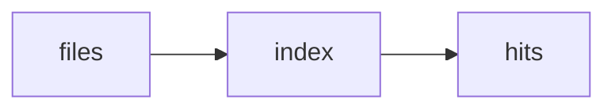

# 13: Codebase indexing

After this page a repo is files + optional AST, not a mystery blob.

## Data
- Moved from modules/16/00_codebase_indexing_overview.md
- Index: path → text / symbols

## Information
Same retrieve job as RAG, over a tree.

## Knowledge
1. Walk files.
2. Store path + text or symbols.
3. Query.

## Wisdom
Do not invent a new indexer lab.

## The When and Why
- **When:** the agent must find a function.
- **Why:** grep is the simple form of this.

## How it works

## Data contract
hit: `{ "path": "string", "span": "string" }`

## Lab
Module page only.

## Related
- **ripgrep:** the simple sibling.

## Notes
Extra module page as specified.
