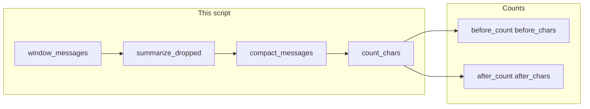

# Lab 1: Compact the context window

A long `messages` list is shortened. The system item and the last N items stay. Dropped turns become one summary string. Before and after counts print. There is no RAG and no HTTP.

## What you touch
- Script: `lab1_context_window.py` (write it next to this brief; there is no reference `.py` yet)
- Function: `count_chars(messages)` returns `len(json.dumps(messages))`
- Function: `window_messages(messages, last_n)` keeps the first `role: "system"` item and the last `last_n` items
- Function: `summarize_dropped(dropped)` returns `{ "role": "assistant", "content": "string" }` from the dropped items. No POST.
- Function: `compact_messages(messages, last_n)` returns system + summary + last N
- Fixture list in `__main__` (exact items in Steps). `last_n` is `4`
- No HTTP. This script does not read `OLLAMA_HOST` or `OLLAMA_MODEL`.
- No vector store. No PII tokens. No repo walk.

## Steps


1. Build a fixture `messages` list with one system item (`You add numbers.`) then eight turns: user `What is 1 plus 1?` / assistant `2`, user `What is 2 plus 2?` / assistant `4`, user `What is 3 plus 3?` / assistant `6`, user `What is 4 plus 4?` / assistant `8`. That is 9 items.
2. Write `count_chars`. Return `len(json.dumps(messages))`.
3. Write `window_messages(messages, last_n)`. If `messages[0]["role"]` is `system`, keep that item. Keep `messages[-last_n:]`. Drop the middle. Return `{ "kept": [...], "dropped": [...] }`.
4. Write `summarize_dropped(dropped)`. Join each dropped `role` and `content` with `; `. Prefix `Summary: `. Return `{ "role": "assistant", "content": that string }`. Do not POST.
5. Write `compact_messages(messages, last_n)`. Call `window_messages`. If `dropped` is not empty, insert `summarize_dropped(dropped)` after the system item and before the kept tail. Return the new list.
6. In `__main__`, print `before_count` (`len(messages)`) and `before_chars` (`count_chars`). Call `compact_messages(messages, 4)`. Print `after_count` and `after_chars`. Print each kept `role` and `content`.
7. Confirm `after_count` is less than `before_count` and `after_chars` is less than `before_chars`. Confirm the first item is still the system line and the last two items are `What is 4 plus 4?` / `8`. Do not call `search`. Do not POST.

## Data contract
Only the keys this script writes and reads.

**Fixture item**

```json
{ "role": "system", "content": "You add numbers." }
```

**window_messages return**

```json
{
  "kept": [{ "role": "string", "content": "string" }],
  "dropped": [{ "role": "string", "content": "string" }]
}
```

**Summary item**

```json
{ "role": "assistant", "content": "Summary: user What is 1 plus 1?; assistant 2; user What is 2 plus 2?; assistant 4" }
```

**compact_messages return** (system + summary + last 4)

```json
[
  { "role": "system", "content": "You add numbers." },
  { "role": "assistant", "content": "Summary: string" },
  { "role": "user", "content": "What is 3 plus 3?" },
  { "role": "assistant", "content": "6" },
  { "role": "user", "content": "What is 4 plus 4?" },
  { "role": "assistant", "content": "8" }
]
```

The script does not POST this list. Lab 3 is RAG, not this file.

## Run
From the repo root:

```bash
python education/13_memory/lab1_context_window.py
```

```powershell
$env:OLLAMA_HOST="http://192.168.1.29:11434"
$env:OLLAMA_MODEL="qwen3.6:35b-a3b-65k"
python education/13_memory/lab1_context_window.py
```

This script ignores `OLLAMA_HOST` and `OLLAMA_MODEL`. They are listed so the lab Run block matches the other chapters. There is no HTTP call.

## What you should see
`before_count` `9` and a `before_chars` integer. Then `after_count` `6` and a smaller `after_chars`. Then the six kept items: system `You add numbers.`, one `Summary:` line that mentions `1 plus 1` and `2 plus 2`, then `What is 3 plus 3?` / `6` / `What is 4 plus 4?` / `8`. If `after_count` is still 9, the middle was not dropped. If you see a retrieved chunk or `[PERSON_1]`, you opened lab 3. If you see a POST, you added HTTP this lab does not need.

## Stop here
This is a window plus a local summary string. Do not POST. Do not add Chroma or embeddings. Do not redact PII. Do not walk a repo. Lab 3 is RAG. Lab 2 is episodic vs procedural. Lab 4 is symbol hits.

## Notes
- Write `lab1_context_window.py` next to this brief. There is no reference `.py` in the repo yet.
- `last_n` is 4 so two recent turns stay. The summary is a join, not a model call.
- Keys written and read match this brief. Do not edit other `.py` files in the repo.
