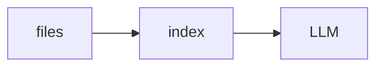

# Lab 3: Local private RAG

After this lab a local file showed up in the answer.

## Data
- Script: `lab3_local_private_rag.py`

## Information
Index → retrieve → POST.

## Knowledge
1. Index.
2. Ask.
3. See a citation.

## Wisdom
Not cloud RAG.

## The When and Why
- **When:** answers must stay on disk.
- **Why:** the model fabricates without chunks.

## How it works



## Data contract
chunk list in the prompt

## Run

```bash
python education/13_memory/lab3_local_private_rag.py
```

## What you should see
An answer that quotes a local path.

## What this becomes later
Codebase page is the same idea on a repo.

## Related
- **Chapter 11:** local server.

## Notes

