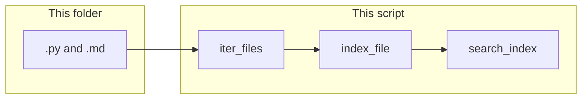

# Lab 4: Codebase index hits

This chapter folder is walked. A substring query prints hits with `path` and `span`. There are no embeddings and no HTTP.

## What you touch
- Script: `lab4_codebase_index.py` (write it next to this brief; there is no reference `.py` yet)
- Root: `os.path.dirname(__file__)` (this `education/13_memory` folder)
- Function: `iter_files(root)` yields paths. Skip `.git`. Keep only `.py` and `.md`
- Function: `index_file(path)` returns `{ "path": path, "text": text, "symbols": [names] }`
- Function: `search_index(index, query)` returns a list of `{ "path": "string", "span": "string" }`
- Query in `__main__`: `run_airgapped_private_rag`
- `span` is a 1-based line range `start:end` for the matching line (a single line is `N:N`)
- No HTTP. This script does not read `OLLAMA_HOST` or `OLLAMA_MODEL`.
- No embeddings. No PII redaction. Do not treat lab 3 as this lab.

## Steps


1. Write `iter_files(root)`. `os.walk` the root. Skip any directory named `.git`. Yield files whose names end with `.py` or `.md`.
2. Write `index_file(path)`. Read the file as text. Collect `symbols`: for each line, if it starts with `def ` or `class ` (after strip), take the name before `(` or `:`. Return `{ "path": path, "text": text, "symbols": names }`.
3. Write `search_index(index, query)`. For each record, split `text` into lines. If a line contains `query`, append `{ "path": record["path"], "span": f"{n}:{n}" }` where `n` is the 1-based line number. Also, if `query` is in `symbols`, keep that hit (the `def` line already matches the substring).
4. In `__main__`, set `root` to `os.path.dirname(__file__)`. Build `index` by calling `index_file` on each `iter_files` path. Call `search_index(index, "run_airgapped_private_rag")`.
5. Print each hit as `HIT path=` plus the path plus ` span=` plus the span. Print `hit_count` as the length of the list.
6. Confirm at least one hit whose path ends with `lab3_local_private_rag.py` and whose span looks like `N:N`. Do not POST. Do not call `sanitize` or `restore`.

## Data contract
Only the keys this script writes and reads.

**Index record**

```json
{ "path": "string", "text": "string", "symbols": ["run_airgapped_private_rag"] }
```

**Hit**

```json
{ "path": "string", "span": "66:66" }
```

`span` is `start:end` in 1-based line numbers. A one-line match is `N:N`. The exact `N` depends on `lab3_local_private_rag.py`. Do not hardcode the number.

The script does not POST. Lab 3 is document RAG. This lab is a walk plus a substring.

## Run
From the repo root:

```bash
python education/13_memory/lab4_codebase_index.py
```

```powershell
$env:OLLAMA_HOST="http://192.168.1.29:11434"
$env:OLLAMA_MODEL="qwen3.6:35b-a3b-65k"
python education/13_memory/lab4_codebase_index.py
```

This script ignores `OLLAMA_HOST` and `OLLAMA_MODEL`. They are listed so the lab Run block matches the other chapters. There is no HTTP call.

## What you should see
One or more `HIT path=...lab3_local_private_rag.py span=N:N` lines, then `hit_count` greater than 0. The path is under `education/13_memory`. If `hit_count` is 0, the walk skipped `.py` files or the query string is wrong. If you see `[PERSON_1]` or a sanitized chunk, you opened lab 3. If you see a POST, you added HTTP this lab does not need.

## Stop here
This is a walk and a substring. Do not add embeddings. Do not add tree-sitter. Do not redact PII. Do not POST. Lab 1 is the window. Lab 2 is fact vs how-to. Lab 3 is private RAG.

## Notes
- Write `lab4_codebase_index.py` next to this brief. There is no reference `.py` in the repo yet.
- Skip `.git` and keep `.py` / `.md` only so the walk stays small.
- Keys written and read match this brief. Do not edit other `.py` files in the repo.
