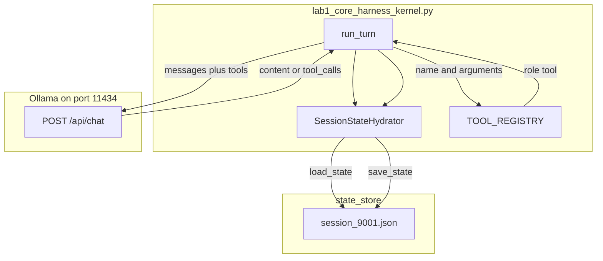

# 13: One Agent: Unifying Persona, Tools, Execution Loop, and Persistent State

By the end of this chapter, you will build a complete, self-contained single-agent harness (`CoreAgentKernel`) that unifies system personas, tool registries, multi-turn execution loops, and persistent session state hydration.

In earlier chapters, we studied individual agent primitives in isolation—contracts in Chapter 02, dispatchers in Chapter 03, ReAct loops in Chapter 04, and persistence in Chapter 07. In this chapter, we bring them all together into a unified agent runtime.

## Data
A complete single-agent kernel coordinates four fundamental pillars:
1. **System Persona**: A foundational `role: "system"` prompt setting identity, operational constraints, and tool usage rules.
2. **Tool Capabilities**: Schema specifications (`TOOLS_SCHEMA`) and matching Python callables (`TOOL_REGISTRY`).
3. **Execution Loop**: The ReAct cycle that queries the LLM, resolves tool calls, feeds observation results back into context, and repeats until a final answer is ready.
4. **Session State Hydration**: `SessionStateHydrator` manages loading and writing `state_store/{session_id}.json` (`{"session_id": str, "messages": list, "turn_count": int}`) so conversations persist across multiple turns and process restarts.

## Information
Without persistent hydration, each user interaction starts from a blank slate, forgetting previous facts and context.

By wrapping execution in a stateful kernel:
- **Conversation Continuity**: Facts shared in Turn 1 (e.g. `"My name is Jacob"`) are saved to disk and seamlessly restored in Turn 2.
- **Unified Harness**: A single entry point `run_turn(session_id, user_prompt)` encapsulates loading history, dispatching tools, prompting the model, and checkpointing state.

## Knowledge
Here is the step-by-step procedure:
1. Initialize `SessionStateHydrator` targeting a local JSON storage folder (`state_store/`).
2. Implement `CoreAgentKernel.run_turn(session_id, user_prompt)`:
   - Hydrate existing conversation history or initialize a new session.
   - Inject the system persona if starting a fresh session.
   - Append the incoming user prompt and increment `turn_count`.
   - Send messages to `{OLLAMA_HOST}/api/chat` with tool schemas attached.
   - Execute any requested tool calls and append observation messages.
   - Append the final assistant response and save the updated session file to disk.
3. Test multi-turn memory by introducing a fact in Turn 1 and querying it in Turn 2.

## Wisdom
A robust single-agent harness is the bedrock for all advanced agentic patterns. Master the stateful single-agent loop before adding multi-agent coordination.

## The When and Why
- **When**: Building conversational assistants, coding copilots, or stateful agent services that require persistent memory across turns.
- **Why**: Stateless API endpoints cannot maintain conversational coherence without explicit session persistence.

## How it works



Walkthrough of the lab session `session_9001`:

1. `run_turn("session_9001", "Hello! My name is Jacob.")` loads a missing file as an empty `messages` list.
2. The script appends a `role: system` persona if the list is empty, then the user line.
3. It POSTs `model`, `messages`, and `tools` to `/api/chat`.
4. If `tool_calls` appear, it runs the chapter 04 loop and appends `role: tool` results. If not, it reads `message.content`.
5. It appends the assistant text and writes `state_store/session_9001.json`.
6. `run_turn("session_9001", "What is my name?")` loads that file. The first user line is still in `messages`. The second reply should contain Jacob.

The new fact is the file between the two calls.

## Data contract

**Intended request** `POST /api/chat`

```json
{
  "model": "llama3.2:1b",
  "messages": [],
  "tools": [],
  "stream": false,
  "options": { "temperature": 0.0 }
}
```

**Session JSON** (`state_store/{session_id}.json`)

```json
{
  "session_id": "session_9001",
  "messages": [],
  "turn_count": 0
}
```

**`run_turn` return**

```json
{
  "session_id": "session_9001",
  "turn_count": 2,
  "thinking": "string",
  "response": "string"
}
```

## Lab
Done when turn 2 answers with the name from turn 1.

- Module: [this file](./00_persona_tools_loop_state.md)
- Lab 1: [lab1_core_harness_kernel.py](./lab1_core_harness_kernel.py) / [lab1_core_harness_kernel.md](./lab1_core_harness_kernel.md) - two `run_turn` calls on `session_9001`. Done when the second `response` contains Jacob and `state_store/session_9001.json` exists.

## Related
- **Chapter 04 loop:** the intended inner loop when `tool_calls` appear.
- **Chapter 05 JSON file:** same save/load. This chapter names the file a session.
- **Claude Code / Cursor harness:** same four pieces at product scale.

## Notes
- The reference script remembers `My name is Jacob` across two `run_turn` calls.
- Contract drift vs `lab1_core_harness_kernel.py`: no `OLLAMA_HOST` / `OLLAMA_MODEL` read (URL and model are literals). Host is hardcoded to `http://192.168.1.29:11434`. Route is `/api/generate`, not `/api/chat`. No `tools` key and no dispatcher. No `role: system` persona on the wire. `messages` are joined into one `prompt` string. `temperature` is `0.2`. `CoTStreamDemuxer` runs on every reply. The print banner still says `MODULE 11`. The intended contract is persona plus tools plus the chapter 04 loop plus the session file. Write that in your copy. Leave the reference file as-is.
- Do not commit `state_store/*.json`.
