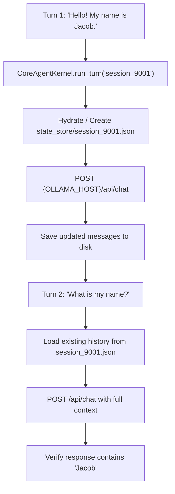

# Lab 1: Building a Core Agent Harness with Session State Hydration

In this lab, you will build a complete single-agent kernel (`CoreAgentKernel`) with persistent session hydration (`SessionStateHydrator`), verifying that facts established in Turn 1 (e.g. user name) persist and inform responses in Turn 2.

---

## What you touch
- Script: `lab1_core_harness_kernel.py`
- Main Classes & Functions:
  - `SessionStateHydrator.load_state(session_id) -> dict`
  - `SessionStateHydrator.save_state(session_id, state)`
  - `CoreAgentKernel.run_turn(session_id, user_prompt) -> dict`
- State Storage: `state_store/{session_id}.json` (runtime persistent session file)
- URL / Endpoint: `{OLLAMA_HOST}/api/chat` (defaults to `http://127.0.0.1:11434/api/chat`)
- Multi-Turn Verification:
  - Turn 1: `"Hello! My name is Jacob."`
  - Turn 2: `"What is my name?"`

---

## Steps


1. Read `OLLAMA_HOST` and `OLLAMA_MODEL` from environment variables, defaulting to `http://127.0.0.1:11434` and `llama3.2:1b`.
2. Implement `SessionStateHydrator` to read and write `state_store/{session_id}.json` with `session_id`, `messages`, and `turn_count`.
3. Implement `CoreAgentKernel.run_turn(session_id, user_prompt)`:
   - Hydrate existing state.
   - If starting fresh, inject a system persona (e.g. `"You are a helpful AI assistant."`).
   - Append the user prompt and increment `turn_count`.
   - Call the chat completion endpoint `{OLLAMA_HOST}/api/chat`.
   - Append the model response to `messages` and persist state to disk via `save_state()`.
4. In `__main__`:
   - Initialize the kernel for `session_9001`.
   - Execute Turn 1: `"Hello! My name is Jacob."`.
   - Execute Turn 2: `"What is my name?"`.
   - Assert that Turn 2 accurately recalls `"Jacob"` and that `turn_count` equals 2.

---

## Data contract

**Session File (`state_store/session_9001.json`)**

```json
{
  "session_id": "session_9001",
  "turn_count": 2,
  "messages": [
    { "role": "system", "content": "You are a helpful AI assistant." },
    { "role": "user", "content": "Hello! My name is Jacob." },
    { "role": "assistant", "content": "Hello Jacob! Nice to meet you. How can I help you today?" },
    { "role": "user", "content": "What is my name?" },
    { "role": "assistant", "content": "Your name is Jacob." }
  ]
}
```

**`run_turn` Return Object**

```json
{
  "session_id": "session_9001",
  "turn_count": 2,
  "thinking": "",
  "response": "Your name is Jacob."
}
```

---

## Run
From the repository root, run:

```bash
python education/13_one_agent/lab1_core_harness_kernel.py
```

```powershell
python education/13_one_agent/lab1_core_harness_kernel.py
```

---

## What you should see
- `[KERNEL] Starting Turn 1 for Session: 'session_9001'` followed by response greeting Jacob.
- `[KERNEL] Starting Turn 2 for Session: 'session_9001'` followed by response correctly answering `"Your name is Jacob."`.
- Checkpoint verification confirming `turn_count: 2` in `state_store/session_9001.json`.

---

## Stop here
You have successfully implemented a unified single-agent kernel with session state hydration! In Chapter 14, we will coordinate multiple agents using orchestrator-worker and peer-to-peer topologies.

Next up: [Chapter 14: Two Agents](../14_two_agents/00_topologies.md).

---

## Notes
*(Record your multi-turn conversation trace and state checkpoint results here)*

