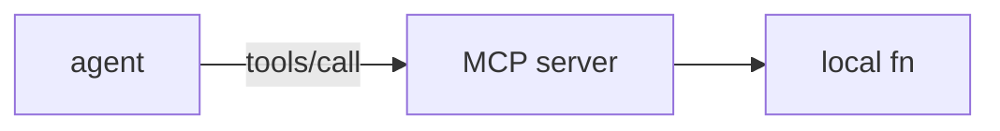

# 14: MCP

After this page the chapter 03 dispatcher is another process speaking JSON-RPC.

## Data
- Transports: stdio, SSE
- Methods: `tools/list`, `tools/call`
- Moved from modules/13 and MCP half of old tool-use + 01/02 skills

## Information
Your agent does not import the tool. It calls a server.

## Knowledge
1. List tools.
2. Call by name.
3. Read the JSON result.

## Wisdom
Do not invent a 200-line MCP server script. Brief only if no lab exists.

## The When and Why
- **When:** tools must live outside the agent PID.
- **Why:** in-process registry cannot be shared across apps.

## How it works

## Data contract
JSON-RPC: `{ "method": "tools/call", "params": { "name": "string", "arguments": {} } }`

## Lab
- [lab1_mcp_brief.md](./lab1_mcp_brief.md) — brief only; no old script.

## Related
- **Chapter 03 registry:** same lookup, same process.

## Notes
Skills/plugins (`SKILL.md`) are files loaded into context, not MCP.
