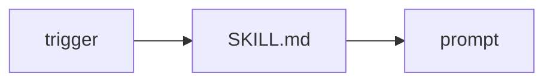

# 14: Skills and plugins

After this page a skill is a markdown/file bundle loaded when needed, not a second model.

## Data
- `SKILL.md` or a helper script
- Moved from modules/01/02_skills_plugins_and_mcp.md

## Information
MCP is a process. A skill is a file in the prompt.

## Knowledge
1. Detect the trigger.
2. Read the file.
3. Append to system or user.

## Wisdom
Do not merge skill and MCP into one mechanism.

## The When and Why
- **When:** a workflow has extra instructions.
- **Why:** stuffing every skill every turn wastes the window.

## How it works

## Data contract
Skill body: markdown string.

## Lab
No extra script.

## Related
- **Chapter 13 procedural memory:** the same file idea.

## Notes
MCP half of old tool-use is on 00_mcp_overview.
