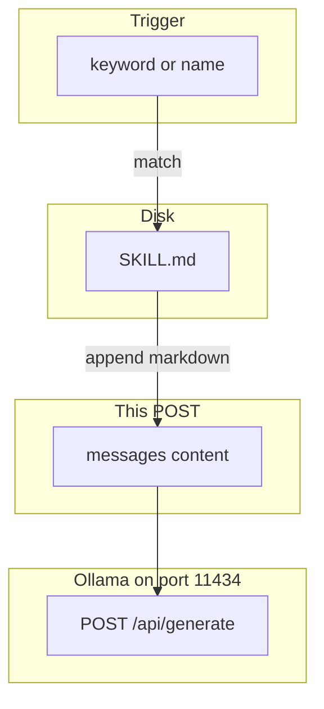

# 14: Skills and plugins

After this chapter a skill is a markdown file (or a small helper script) loaded when a trigger matches. It is not a second model and not an MCP server. You read the file and append the text to the system or user message.

## Data
A **skill** is a file bundle. The usual file is `SKILL.md`: a markdown string with extra instructions for one workflow (how to format a PR, how to query a table, how to write a test). A plugin can also include a helper script next to that file. The body you care about is still a string.

A **trigger** is the rule that says "load this file now". It can be a keyword in the user text, a path match, or an explicit name. If the trigger does not match, you do not read the file.

Loading means: `open("SKILL.md").read()`, then append that string to `messages` as `role: "system"` (or as extra `content` on the user turn). The next POST includes it. The model is the same `OLLAMA_MODEL`.

This file was moved from `modules/01/02_skills_plugins_and_mcp.md`. The MCP half lives on `00_mcp_overview.md`. Chapter 13 called this procedural memory: how to do a job, not a fact row.

`OLLAMA_HOST` should default to `http://192.168.1.29:11434`. `OLLAMA_MODEL` should default to `qwen3.6:35b-a3b-65k`. The route is still `POST /api/generate` or `POST /v1/chat/completions`. The new work is the file read, not a new host.

## Information
MCP is a process. A skill is a file in the prompt. Do not merge them into one mechanism. `tools/call` runs code in another PID. `SKILL.md` is text you stuff into `content`.

Stuffing every skill every turn wastes the context window (chapter 13 compaction). Load one file when the trigger matches. Leave the others on disk.

A skill is not a second model. You do not start another provider. You do not change `OLLAMA_MODEL`. You add instructions to the same POST.

## Knowledge
1. Detect the trigger (a keyword, a path, or a name the user typed).
2. Read the file: `SKILL.md` or the helper script's docstring. The body is a markdown string.
3. Append that string to the system message (`role: "system"`, key `content`) or to the user message.
4. POST `model` and `messages` (or `prompt`) to `{OLLAMA_HOST}/api/generate` or `/v1/chat/completions`.
5. Do not start an MCP server and do not `import` a tool function as a substitute for the file.

## Wisdom
Stop when one `SKILL.md` was read and its text appeared in the POST body. Do not merge skill loading with `tools/list` / `tools/call`. If you merge them, a missing instruction could be a missing file or a failed RPC.

## The When and Why
- **When:** a workflow has extra instructions that are not needed on every turn.
- **Why:** stuffing every skill every turn wastes the window. A file you load on a trigger keeps the unused text on disk.

## How it works



Walkthrough of one load:

1. The user text matches a trigger (for example the word `pr-review`).
2. You read `SKILL.md` as a string.
3. You append that string to the system `content` (or to the user `content`).
4. You POST the updated `messages` to `{OLLAMA_HOST}/api/generate` or `/v1/chat/completions`.
5. Unused skill files stay on disk. They are not in this POST.

Nothing in that walkthrough opens a JSON-RPC socket. The new work is the file in the prompt.

## Data contract

**Skill body** (intended)

```json
{ "path": "SKILL.md", "body": "markdown string" }
```

**Request after load** `POST /v1/chat/completions` (or flatten into `prompt` on `/api/generate`)

```json
{
  "model": "qwen3.6:35b-a3b-65k",
  "messages": [
    { "role": "system", "content": "{SKILL.md body}" },
    { "role": "user", "content": "string" }
  ]
}
```

There is no skills `.py` in this folder. The intended contract is still a markdown string in `content`.

## Lab
Done when you can name trigger, file, and append, and say how that differs from `tools/call`.

- Module: [this file](./01_skills_and_plugins.md)
- Lab 2 (missing): detect a trigger, read `SKILL.md`, POST with the body in `content`. See [STUB_lab2_skills.md](./STUB_lab2_skills.md) after it is added.
- Lab 1 (this folder): [lab1_mcp_brief.md](./lab1_mcp_brief.md) — JSON-RPC, not a file load.

## Related
- **Chapter 13 procedural memory:** the same file idea. This page is the load step.
- **00_mcp_overview.md:** a process, not a markdown file.

## Notes
- MCP half of the old tool-use page is on `00_mcp_overview.md`.
- No paired `.py`. Do not treat lab 1 as the skills lab.
