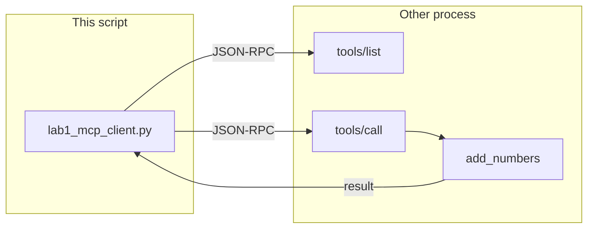

# Lab 1: MCP brief

After this lab you have listed tools from another process and called one. No reference `.py` shipped. Keep the client small.

## What you touch
- Script you will write: `lab1_mcp_client.py` (this folder)
- Methods: `tools/list`, `tools/call`
- Transport: stdio (child process, JSON on stdin/stdout) or SSE / HTTP
- Keys sent: `jsonrpc` (`"2.0"`), `id`, `method`, `params` (`name`, `arguments` on call)
- Keys read: `result.tools` on list; `result` (or `result.content`) on call
- Intended print shape: `{ "name": "add_numbers", "content": "5" }`

## Steps


1. This lab does not need a model POST. Do not set `OLLAMA_HOST` or `OLLAMA_MODEL`. The script ignores those vars.
2. Start or mock a server that lists one tool (`add_numbers`) and implements `tools/call`. Stdio is enough: a child that reads one JSON line and writes one JSON line. Do not write a 200-line fake server.
3. Send `{ "jsonrpc": "2.0", "id": 1, "method": "tools/list", "params": {} }`. Print each `name` in `result.tools`.
4. Send `{ "jsonrpc": "2.0", "id": 2, "method": "tools/call", "params": { "name": "add_numbers", "arguments": { "a": 2, "b": 3 } } }`.
5. Print the `result` text (for example `5`). Keep the client under 50 lines.
6. Do not load a `SKILL.md` and do not import the function into the client. The call must cross a process boundary (or a mock of that boundary).

## Data contract
Only the JSON-RPC keys this brief asks you to send and read.

**List**

```json
{
  "jsonrpc": "2.0",
  "id": 1,
  "method": "tools/list",
  "params": {}
}
```

**Call**

```json
{
  "jsonrpc": "2.0",
  "id": 2,
  "method": "tools/call",
  "params": { "name": "add_numbers", "arguments": { "a": 2, "b": 3 } }
}
```

**Intended print**

```json
{ "name": "add_numbers", "content": "5" }
```

## Run
From the repo root, after you write the script:

```bash
python education/14_mcp/lab1_mcp_client.py
```

```powershell
python education/14_mcp/lab1_mcp_client.py
```

This script does not read `OLLAMA_HOST` or `OLLAMA_MODEL`. Do not set those vars for this lab.

## What you should see
A listed tool name (`add_numbers`) and a call result (`5` or the server's `content` text). If the child process exits before the reply, you will see an empty stdout or a broken pipe. If `method` is wrong, the server should return a JSON-RPC `error`, not a Python traceback in the client. If you imported `add_numbers` in the client and never sent JSON-RPC, you skipped the process boundary.

## Stop here
This is not RAG-for-tools and not a skill loader. Do not add a vector search over schemas, a `SKILL.md` read, or a 200-line server. Next: [lab2_skills.md](./lab2_skills.md), then [00_harness_overview.md](../15_synthesis/00_harness_overview.md).

## Notes
- No existing script was in the old tree. There is no contract drift vs a `.py`.
- Paste a real run here: the listed name, the call `arguments`, and the printed `content`.
- Chapter 03 already did in-process `TOOL_REGISTRY`.
