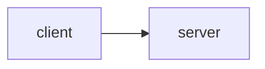

# Lab 1: MCP brief

After this lab you have listed tools from a process and called one. No reference `.py` shipped.

## Data
- Script you will write: `lab1_mcp_client.py` if you implement it
- Methods: `tools/list`, `tools/call`

## Information
Client talks JSON-RPC. Server runs the function.

## Knowledge
1. Start or mock a server that lists one tool.
2. Call it.
3. Print the result.
4. Keep it under 50 lines. Do not invent a 200-line fake server.

## Wisdom
This is not RAG-for-tools.

## The When and Why
- **When:** the registry must leave the agent process.
- **Why:** chapter 03 is not enough when two apps share tools.

## How it works



## Data contract
See the module RPC shape.

## Run

```bash
# write lab1_mcp_client.py then:
python education/14_mcp/lab1_mcp_client.py
```

## What you should see
A listed tool name and a call result.

## What this becomes later
Chapter 15 can host MCP next to the kernel.

## Related
- **Chapter 03:** in-process version.

## Notes
No existing script was in the old tree.
