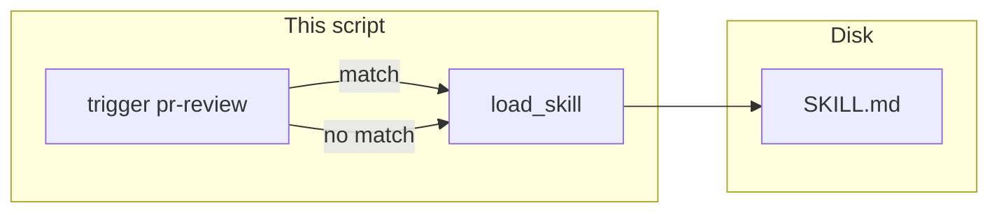

# Lab 2: Load a skill file

A trigger string decides whether `SKILL.md` is read. On a match the body prints. This is not MCP and not a second agent.

## What you touch
- Script: `lab2_skills.py` (write it next to this brief; there is no reference `.py` yet)
- File: `SKILL.md` (write it next to this brief; there is no reference skill file yet)
- Trigger: `pr-review`
- Function: `load_skill(user_text, skill_path)` returns `{ "loaded": true, "path": path, "body": text }` or `{ "loaded": false }`
- Two user lines in `__main__`: `Please do a pr-review on this branch` and `What is 2+2?`
- Print the trigger, the path, and the body on a match. Print `skipped` on a miss.
- No HTTP. This script does not read `OLLAMA_HOST` or `OLLAMA_MODEL`.
- Do not send `tools/list` or `tools/call`. Do not start a second model.

## Steps


1. Write `SKILL.md` with exactly these three lines:
   - `# PR review`
   - `Check the diff. List risks. Do not merge.`
   - (a trailing newline is fine)
2. Set `skill_path` to `os.path.join(os.path.dirname(__file__), "SKILL.md")`.
3. Write `load_skill(user_text, skill_path)`. If `pr-review` is not in `user_text`, return `{ "loaded": False }`. Do not open the file. If it is in `user_text`, `open` the path, read the body, return `{ "loaded": True, "path": skill_path, "body": text }`.
4. In `__main__`, call `load_skill("Please do a pr-review on this branch", skill_path)`. Print `trigger` `pr-review`, then `path`, then `body`.
5. Call `load_skill("What is 2+2?", skill_path)`. Print `skipped`.
6. Confirm the first call prints `Check the diff. List risks. Do not merge.` Confirm the second call does not print the body. Do not POST. Do not send JSON-RPC.

## Data contract
Only the keys this script writes and reads.

**SKILL.md body**

```text
# PR review
Check the diff. List risks. Do not merge.
```

**Match return**

```json
{
  "loaded": true,
  "path": "SKILL.md",
  "body": "# PR review\nCheck the diff. List risks. Do not merge.\n"
}
```

**Miss return**

```json
{ "loaded": false }
```

The script does not POST. Lab 1 is JSON-RPC. This lab is a file read.

## Run
From the repo root:

```bash
python education/14_mcp/lab2_skills.py
```

```powershell
$env:OLLAMA_HOST="http://192.168.1.29:11434"
$env:OLLAMA_MODEL="qwen3.6:35b-a3b-65k"
python education/14_mcp/lab2_skills.py
```

This script ignores `OLLAMA_HOST` and `OLLAMA_MODEL`. They are listed so the lab Run block matches the other chapters. There is no HTTP call.

## What you should see
`trigger` `pr-review`, then the path of `SKILL.md`, then the body including `Check the diff. List risks. Do not merge.`. Then `skipped` for `What is 2+2?`. If both print the body, the trigger check is missing. If you see `tools/list` or `add_numbers`, you opened lab 1. If you see a POST, you added HTTP this lab does not need.

## Stop here
This is a file load. Do not add `tools/list` or `tools/call`. Do not start a second model. Do not write a 200-line MCP server. Lab 1 is the JSON-RPC client. Chapter 13 lab 2 is a fact row, not a skill file.

## Notes
- Write `lab2_skills.py` and `SKILL.md` next to this brief. There is no reference file in the repo yet.
- Read the file only when the trigger matches so unused skills stay on disk.
- Keys written and read match this brief. Do not edit other `.py` files in the repo.
