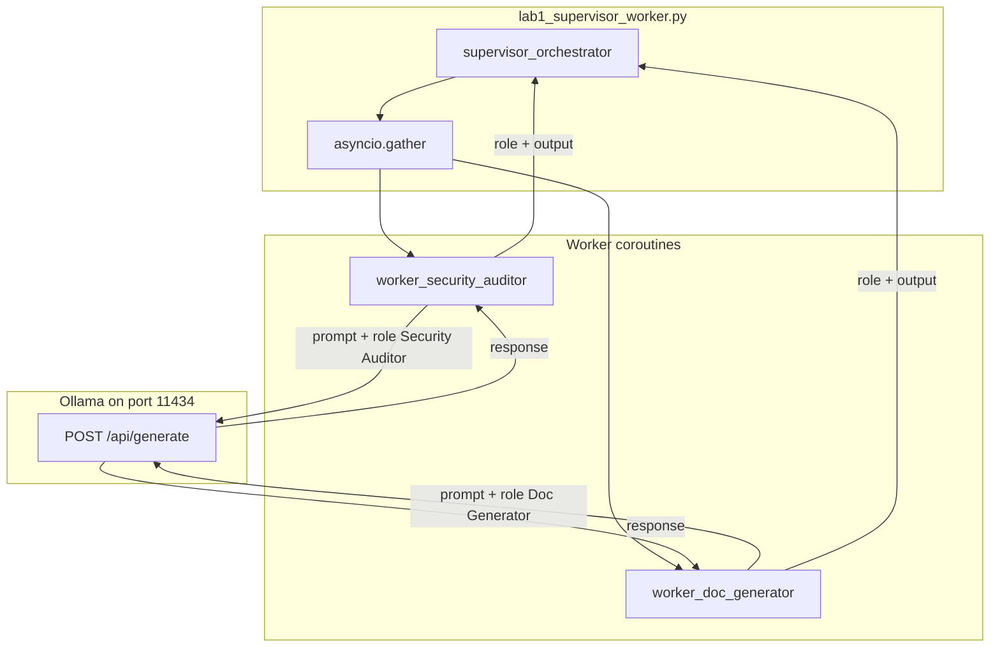

# 14: Two-Agent Topologies: Orchestration Patterns and Multi-Agent Coordination

By the end of this chapter, you will understand and implement multi-agent communication topologies: **Hub-and-Spoke (Supervisor-Worker)**, **Peer Handoff**, and **Agent Capability Manifests (Agent Cards)**.

In Chapter 13, we built a self-contained single-agent harness. In this chapter, we explore how multiple specialized agents collaborate efficiently without polluting each other's context or leaking prompts.

## Data
We define three primary multi-agent topologies:
1. **Hub-and-Spoke (Supervisor-Worker)**: A central supervisor coordinates multiple specialized workers in parallel (`asyncio.gather()`), collecting and merging their findings (e.g. security audits and technical documentation).
2. **Peer Handoff (A2A Transfer)**: One agent executes its task and passes a structured JSON envelope directly to a peer agent across role boundaries.
3. **Capability Manifest (`agent_card.json`)**: A machine-readable declaration of an agent's identity, version, capabilities, skill schemas, and transport endpoints for dynamic discovery.

## Information
When a single agent is assigned multiple complex personas (e.g. auditing security vulnerabilities AND writing customer documentation), prompt instructions frequently bleed across tasks, degrading output quality.

Multi-agent topologies solve this:
- **Isolated Contexts**: Each worker receives only the relevant system persona and snippet without seeing peer intermediate reasoning.
- **Concurrent Execution**: Fan-out execution with `asyncio.gather()` processes independent sub-tasks in parallel, dramatically reducing total latency.
- **Structured Fan-In**: The supervisor joins individual worker reports into a coherent consolidated summary.

## Knowledge
Here is the step-by-step procedure:
1. Select the appropriate topology (e.g. hub-and-spoke for parallel tasks, peer handoff for sequential transitions).
2. Define narrow, specialized system personas for each worker.
3. Implement `asyncio.gather()` in `supervisor_orchestrator()` to fan out requests concurrently.
4. Collect standardized `{role: str, output: str}` dictionaries from each worker and merge them into a unified report.
5. Define declarative `agent_card.json` manifests for automated capability discovery.

## Wisdom
Start with simple two-agent topologies before adding complex swarms. Isolated prompts and clean handoff envelopes solve 95% of multi-agent coordination needs without heavy distributed infrastructure.

## The When and Why
- **When**: When tasks require distinct skill sets or when sub-tasks can be executed in parallel without shared conversational state.
- **Why**: Single long prompts with conflicting personas cause prompt confusion. Multi-agent topologies keep prompts focused, modular, and fast.

## How it works



Walkthrough of the lab on the SQL `login` snippet:

1. `asyncio.run(supervisor_orchestrator(sample_code))` starts the hub. `sample_code` is the `login` function that builds a SQL string with f-string interpolation.
2. The supervisor calls `asyncio.gather` on `worker_security_auditor` and `worker_doc_generator`. Both receive the same `code_snippet`.
3. Each worker builds `full_prompt` as `system_prompt` plus `User Task: {code_snippet}` and POSTs it. The auditor prompt asks for two security-flaw bullets. The writer prompt asks for two bullets on what the code does.
4. Each worker reads `response` and returns `{ "role": "...", "output": "..." }`.
5. The supervisor prints `--- {role} Report ---` and `output` for each item, then the duration.

The new fact is two isolated POSTs joined in one process. The workers never see each other's prompt.

## Data contract

**Intended request** (each worker) `POST /api/chat`

```json
{
  "model": "qwen3.6:35b-a3b-65k",
  "messages": [
    { "role": "system", "content": "string" },
    { "role": "user", "content": "string" }
  ],
  "stream": false,
  "options": { "temperature": 0.0 }
}
```

**Worker return**

```json
{
  "role": "Security Auditor",
  "output": "string"
}
```

`role` is `"Security Auditor"` or `"Doc Generator"`. `output` is the model text.

**What the reference script actually sends** `POST /api/generate` with `model`, `prompt` (system string plus `User Task:` plus the snippet), `stream: false`, `options.temperature: 0.0`. It reads `response`. Host and model are hardcoded as `OLLAMA_URL` and `MODEL_NAME`. See Notes.

## Lab
Done when two workers return and the supervisor prints both `role` headers, handoff transfers state cleanly, and agent manifests are validated and discoverable.

- Module: [this file](./00_topologies.md)
- Lab 1: [lab1_supervisor_worker.py](./lab1_supervisor_worker.py) / [lab1_supervisor_worker.md](./lab1_supervisor_worker.md) - `supervisor_orchestrator` gathers two workers. Done when you see `Security Auditor` and `Doc Generator` reports and a duration.
- Lab 2: [lab2_agent_handoff.py](./lab2_agent_handoff.py) / [lab2_agent_handoff.md](./lab2_agent_handoff.md) - peer handoff JSON. Covered on the next page.
- Lab 3: [lab3_agent_card_manifest.py](./lab3_agent_card_manifest.py) / [lab3_agent_card_manifest.md](./lab3_agent_card_manifest.md) - agent capability manifest declaration, validation, and intent-based discovery.

## Related
- **Chapter 07 one agent:** one persona, one session file, one process. Use it until a second prompt is required.
- **01_handoff_protocol.md:** the peer-handoff topology as a five-key JSON object.
- **02_specialized_roles.md:** why each worker gets its own system prompt.
- **03_skill_vs_two_agents.md:** when a skill file is enough and when you need a second process.

## Notes
- Keep one specialized-roles page. The duplicate `02_specialized_roles_*` file was dropped.
- Contract drift vs `lab1_supervisor_worker.py`: no `OLLAMA_HOST` / `OLLAMA_MODEL` read (URL and model are literals). Route is `/api/generate`, not `/api/chat`. System and user text are joined into one `prompt` string. No `messages` key and no `tools` key. `temperature` is `0.0`. The print banner says `MULTI-AGENT SWARM`; the topology is hub-and-spoke, not a swarm. The intended contract is two isolated worker POSTs joined by `asyncio.gather`. Write that in your copy. Leave the reference file as-is.
