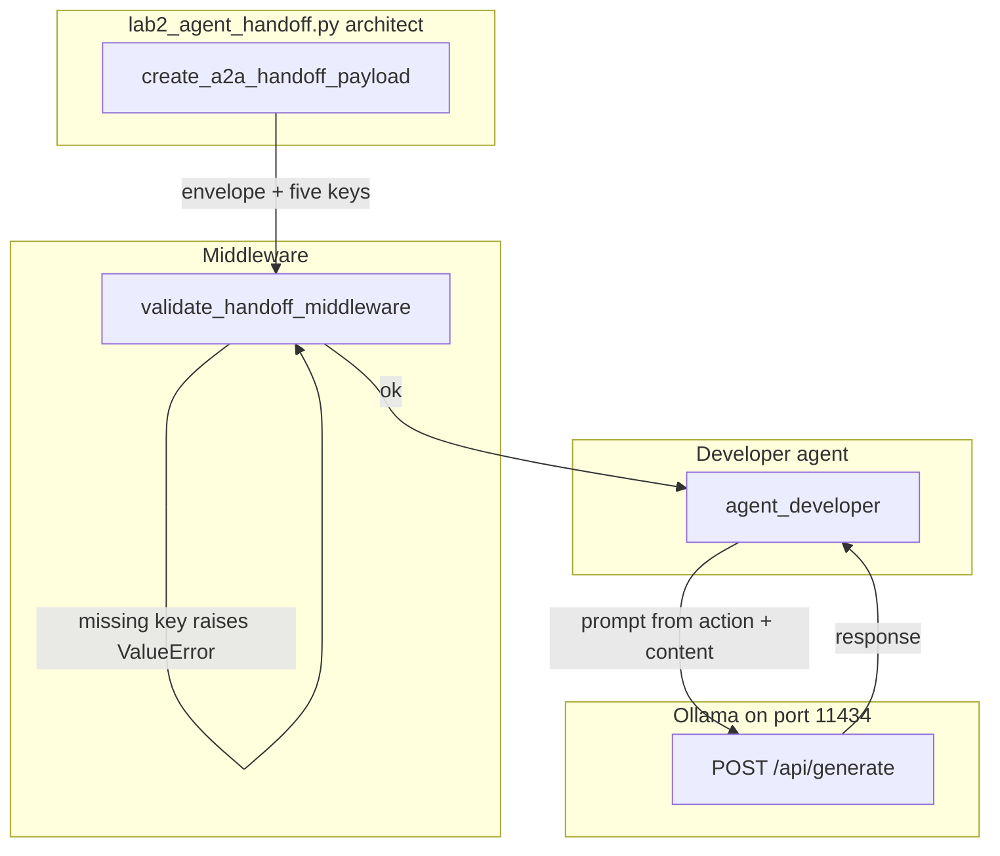

# 14: The Handoff Protocol: Structured Agent-to-Agent (A2A) Contract

By the end of this chapter, you will implement a formal 5-component Agent-to-Agent (A2A) handoff protocol that safely transfers context, code artifacts, action instructions, state checkpoints, and verification commands across role boundaries.

In the previous module, we fanned out independent worker tasks in parallel. In this module, we transition work sequentially from one agent role to another using a strongly validated JSON envelope.

## Data
A robust A2A handoff envelope encapsulates five essential operational keys under `handoff`:
1. **`context`**: High-level problem context (e.g. `goal`, `environment`).
2. **`content`**: The subject code artifact or payload being transferred (e.g. `modified_code`).
3. **`action`**: Concrete next steps for the recipient (e.g. `instruction`, `deliverable`).
4. **`state_dump`**: Upstream execution state (e.g. `checkpoint_id`, `active_branch`).
5. **`verification`**: Acceptance criteria (e.g. `test_command`, `expected_exit_code`).

The top-level envelope includes `protocol_version` (`"2026-01-01"`), `correlation_id` (`"trace-..."`), and the `handoff` payload.

## Information
Unstructured natural language handoffs between agents often lose vital instructions—such as omitting the specific test command, losing the checkpoint ID, or failing to specify the exact deliverable.

A structured envelope prevents this:
- **Fail-Closed Validation**: Middleware validates that all five keys exist before making any downstream LLM calls.
- **Traceability**: A shared `correlation_id` tracks execution across multi-agent hops.
- **Clear Contracts**: The receiving agent receives unambiguous parameters for immediate action.

## Knowledge
Here is the step-by-step procedure:
1. Construct the envelope with `create_a2a_handoff_payload()`.
2. Run `validate_handoff_middleware()` to assert the presence of all five required sections (`context`, `content`, `action`, `state_dump`, `verification`).
3. Pass the validated payload to `agent_developer()`.
4. The recipient extracts `action.instruction` and `content.modified_code` to prompt the model for the deliverable.
5. Return the completed result with status `HANDOFF_COMPLETED` and matching `correlation_id`.

## Wisdom
Treat inter-agent boundaries like network API contracts: validate early, fail fast on schema errors, and track requests with correlation IDs.

## The When and Why
- **When**: Whenever one agent completes an architectural plan, triage, or audit and delegates the implementation or testing to a downstream agent.
- **Why**: Freeform text handoffs cause hallucinated assumptions and missing requirements. A validated 5-key schema guarantees operational precision.

## How it works



Walkthrough of the lab on the SQL concatenation snippet:

1. `create_a2a_handoff_payload` builds the envelope. `content.modified_code` is `query = 'SELECT * FROM users WHERE id=' + user_id`. `action.instruction` is to refactor that into a parameterized query. `verification.test_command` is `pytest tests/test_sql_security.py`. `state_dump.checkpoint_id` is `chk_db_opt_001`.
2. `validate_handoff_middleware` loops `context`, `content`, `action`, `state_dump`, `verification`. All five are present, so it prints the `correlation_id` and returns `True`.
3. `agent_developer` reads `action.instruction`, `content.modified_code`, `context.goal`, and `verification.test_command`.
4. It POSTs one prompt that asks for the corrected Python in one line. It reads `response` into `verified_code`.
5. It returns `{ "correlation_id", "status": "HANDOFF_COMPLETED", "verified_code", "verification_result": "PASSED" }`.

The new fact is the five-key object between the two roles. The model call is the same POST as chapter 00.

## Data contract

**Handoff envelope**

```json
{
  "protocol_version": "2026-01-01",
  "correlation_id": "trace-1",
  "handoff": {
    "context": { "goal": "string", "environment": "string" },
    "content": { "modified_code": "string" },
    "action": { "instruction": "string", "deliverable": "string" },
    "state_dump": { "checkpoint_id": "string", "active_branch": "string" },
    "verification": { "test_command": "string", "expected_exit_code": 0 }
  }
}
```

**Intended developer request** `POST /api/chat`

```json
{
  "model": "qwen3.6:35b-a3b-65k",
  "messages": [
    { "role": "system", "content": "string" },
    { "role": "user", "content": "string" }
  ],
  "stream": false,
  "options": { "temperature": 0.0 }
}
```

**Developer return**

```json
{
  "correlation_id": "trace-1",
  "status": "HANDOFF_COMPLETED",
  "verified_code": "string",
  "verification_result": "PASSED"
}
```

**What the reference script actually sends** `POST /api/generate` with `model`, `prompt` (one string that inlines goal, instruction, and code), `stream: false`, `options.temperature: 0.0`. It reads `response`. Host and model are hardcoded as `OLLAMA_URL` and `MODEL_NAME`. The printed verification line is a constant `Exit Code: 0 (PASSED)`; it does not run `pytest`. See Notes.

## Lab
Done when the five keys validate and the developer return includes `HANDOFF_COMPLETED`.

- Module: [this file](./01_handoff_protocol.md)
- Lab 2: [lab2_agent_handoff.py](./lab2_agent_handoff.py) / [lab2_agent_handoff.md](./lab2_agent_handoff.md) - `create_a2a_handoff_payload`, then `validate_handoff_middleware`, then `agent_developer`. Done when you see `HANDOFF_COMPLETED` and a `correlation_id`.

## Related
- **Chapter 02 JSON:** same `json.loads` habit, more keys.
- **00_topologies.md:** this page is the peer-handoff topology. Lab 1 is hub-and-spoke.
- **correlation_id:** a string you generate. OTel `traceparent` is optional and not in the lab.

## Notes
- Real lab validates the five keys then calls the developer agent.
- Schema check is five `in` tests, not Pydantic.
- Contract drift vs `lab2_agent_handoff.py`: no `OLLAMA_HOST` / `OLLAMA_MODEL` read (URL and model are literals). Route is `/api/generate`, not `/api/chat`. No `messages` key. The architect is inline in `__main__`, not a second kernel. `verification.test_command` is printed but not executed. The intended contract is a five-key `handoff` object that fails closed before the next POST. Write that in your copy. Leave the reference file as-is.
