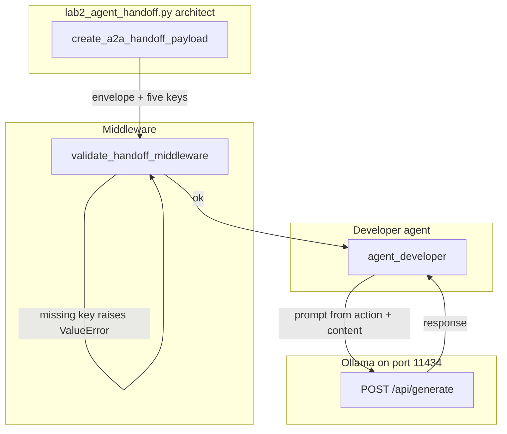

# 14: The Handoff Protocol

After this page an agent-to-agent message is a JSON object with five keys, not a paragraph. The lab is `lab2_agent_handoff.py`.

## Data
A **handoff** is the object one agent gives the next agent when work crosses a role boundary. In this chapter the first role is the architect (the `if __name__ == "__main__"` block). The second role is `agent_developer`.

The **five keys** live under `handoff`:

- `context`: why the work exists. The lab stores `goal` and `environment`.
- `content`: the artifact. The lab stores `modified_code` (the SQL string to fix).
- `action`: what the recipient must do. The lab stores `instruction` and `deliverable`.
- `state_dump`: where the sender stopped. The lab stores `checkpoint_id` and `active_branch`.
- `verification`: how to know the work is done. The lab stores `test_command` and `expected_exit_code`.

The **envelope** wraps those five keys:

- `protocol_version`: a date string. The lab uses `"2026-01-01"`.
- `correlation_id`: one id that follows the transfer. The lab builds `trace-{milliseconds}`.
- `handoff`: the object that holds the five keys.

**Middleware** is `validate_handoff_middleware`. It reads `payload["handoff"]` and raises `ValueError` if any of the five keys is missing. It does not call the model.

`create_a2a_handoff_payload` is the function that builds the envelope. `agent_developer` is the function that reads `action.instruction` and `content.modified_code`, then POSTs.

`OLLAMA_HOST` should default to `http://192.168.1.29:11434`. `OLLAMA_MODEL` should default to `qwen3.6:35b-a3b-65k`. The intended route is `POST /api/chat`. Port `11434` is the Ollama listener.

## Information
A free-text handoff is a paragraph. The next agent has to guess which sentence is the code, which is the test command, and which is the checkpoint. Those guesses drift. A named object fails at validation before the next model call.

The architect builds the object. Middleware checks the five keys. The developer reads `action` and `content` and only then POSTs. If `verification` is missing, `validate_handoff_middleware` raises and `agent_developer` never runs.

OpenTelemetry `traceparent` is optional metadata you can put next to `correlation_id`. It is not a second protocol and it is not in the lab.

## Knowledge
1. Call `create_a2a_handoff_payload` with `correlation_id`, `context_goal`, `content_artifact`, `action_instruction`, `state_checkpoint`, and `verification_cmd`.
2. Call `validate_handoff_middleware(payload)`. A missing key under `handoff` must raise `ValueError`.
3. If validation returns, call `agent_developer(payload)`.
4. The developer reads `handoff["action"]["instruction"]` and `handoff["content"]["modified_code"]`, builds a prompt, and POSTs `model`, `messages`, `stream: false` to `{OLLAMA_HOST}/api/chat` (intended).
5. Print the return object. It should include `correlation_id`, `status`, `verified_code`, and `verification_result`.
6. Do not add Jaeger, a `traceparent` parser, or a third agent.

## Wisdom
Five keys are enough. OTel `traceparent` is optional metadata, not a second protocol. Pydantic is not required; the lab is five `in` tests. If you add a tracer now, a missing `test_command` could look like a span error instead of a schema error.

## The When and Why
- **When:** work must cross a process or role boundary.
- **Why:** a free-text handoff drops the test command or the checkpoint id. A named object fails before the next POST.

## How it works



Walkthrough of the lab on the SQL concatenation snippet:

1. `create_a2a_handoff_payload` builds the envelope. `content.modified_code` is `query = 'SELECT * FROM users WHERE id=' + user_id`. `action.instruction` is to refactor that into a parameterized query. `verification.test_command` is `pytest tests/test_sql_security.py`. `state_dump.checkpoint_id` is `chk_db_opt_001`.
2. `validate_handoff_middleware` loops `context`, `content`, `action`, `state_dump`, `verification`. All five are present, so it prints the `correlation_id` and returns `True`.
3. `agent_developer` reads `action.instruction`, `content.modified_code`, `context.goal`, and `verification.test_command`.
4. It POSTs one prompt that asks for the corrected Python in one line. It reads `response` into `verified_code`.
5. It returns `{ "correlation_id", "status": "HANDOFF_COMPLETED", "verified_code", "verification_result": "PASSED" }`.

The new fact is the five-key object between the two roles. The model call is the same POST as chapter 00.

## Data contract

**Handoff envelope**

```json
{
  "protocol_version": "2026-01-01",
  "correlation_id": "trace-1",
  "handoff": {
    "context": { "goal": "string", "environment": "string" },
    "content": { "modified_code": "string" },
    "action": { "instruction": "string", "deliverable": "string" },
    "state_dump": { "checkpoint_id": "string", "active_branch": "string" },
    "verification": { "test_command": "string", "expected_exit_code": 0 }
  }
}
```

**Intended developer request** `POST /api/chat`

```json
{
  "model": "qwen3.6:35b-a3b-65k",
  "messages": [
    { "role": "system", "content": "string" },
    { "role": "user", "content": "string" }
  ],
  "stream": false,
  "options": { "temperature": 0.0 }
}
```

**Developer return**

```json
{
  "correlation_id": "trace-1",
  "status": "HANDOFF_COMPLETED",
  "verified_code": "string",
  "verification_result": "PASSED"
}
```

**What the reference script actually sends** `POST /api/generate` with `model`, `prompt` (one string that inlines goal, instruction, and code), `stream: false`, `options.temperature: 0.0`. It reads `response`. Host and model are hardcoded as `OLLAMA_URL` and `MODEL_NAME`. The printed verification line is a constant `Exit Code: 0 (PASSED)`; it does not run `pytest`. See Notes.

## Lab
Done when the five keys validate and the developer return includes `HANDOFF_COMPLETED`.

- Module: [this file](./01_handoff_protocol.md)
- Lab 2: [lab2_agent_handoff.py](./lab2_agent_handoff.py) / [lab2_agent_handoff.md](./lab2_agent_handoff.md) - `create_a2a_handoff_payload`, then `validate_handoff_middleware`, then `agent_developer`. Done when you see `HANDOFF_COMPLETED` and a `correlation_id`.

## Related
- **Chapter 02 JSON:** same `json.loads` habit, more keys.
- **00_topologies.md:** this page is the peer-handoff topology. Lab 1 is hub-and-spoke.
- **correlation_id:** a string you generate. OTel `traceparent` is optional and not in the lab.

## Notes
- Real lab validates the five keys then calls the developer agent.
- Schema check is five `in` tests, not Pydantic.
- Contract drift vs `lab2_agent_handoff.py`: no `OLLAMA_HOST` / `OLLAMA_MODEL` read (URL and model are literals). Route is `/api/generate`, not `/api/chat`. No `messages` key. The architect is inline in `__main__`, not a second kernel. `verification.test_command` is printed but not executed. The intended contract is a five-key `handoff` object that fails closed before the next POST. Write that in your copy. Leave the reference file as-is.
