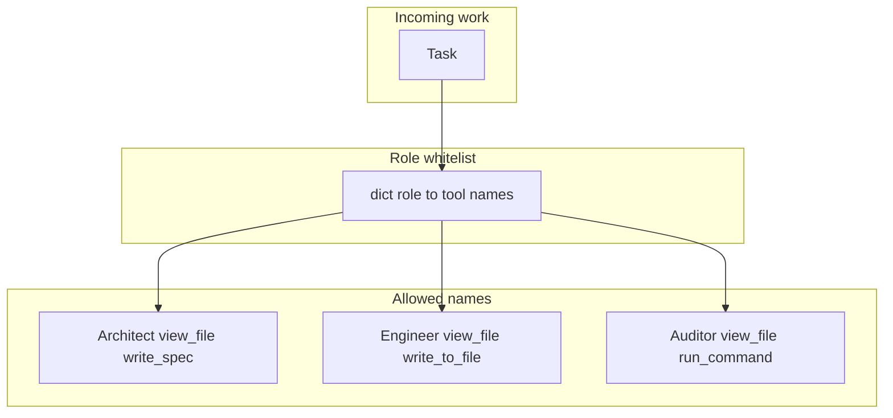

# 14: Specialized Worker Roles: Scoping Personas and Tool Whitelists

By the end of this chapter, you will understand how to design specialized worker roles combining focused system prompts with explicit tool whitelists (such as Architect, Engineer, and Auditor).

In earlier modules, agents were granted access to broad tool sets. In this chapter, we explore why and how to restrict tool privileges according to each agent's specific role.

## Data
A specialized **Role** is defined by two tightly coupled elements:
1. **System Persona**: A concise instruction set declaring role responsibilities and boundaries.
2. **Tool Whitelist**: An explicit dictionary mapping each role to its allowed tool function names:
   - **Architect**: `["view_file", "write_spec"]`
   - **Engineer**: `["view_file", "write_to_file"]`
   - **Auditor**: `["view_file", "run_command"]`

## Information
Assigning all available tools to every agent is risky. A documentation writer might accidentally invoke shell execution commands, or a security auditor might overwrite source files.

Scoping roles with whitelists provides defense-in-depth:
- **Least Privilege**: Each agent is equipped only with the exact tools necessary for its specific function.
- **Deterministic Interception**: In Chapter 16, we implement an RBAC interceptor that returns HTTP 403 Forbidden if an agent attempts to invoke a tool outside its whitelist.

## Knowledge
Here is the step-by-step procedure:
1. Define clear operational boundaries in the role's system prompt.
2. Maintain a central permission mapping (`ROLE_TOOL_PERMISSIONS: dict[str, list[str]]`).
3. Whenever an agent emits a tool call, verify that `tool_name` is present in the role's authorized list before execution.
4. Reject unauthorized tool calls immediately with structured error feedback.

## Wisdom
A persona prompt alone is just advisory text. An enforced tool whitelist is what provides actual security and operational boundaries.

## The When and Why
- **When**: Building multi-agent systems where agents possess distinct authority levels (e.g. read-only reviewers vs read-write developers).
- **Why**: Prompt instructions alone cannot prevent unauthorized tool execution. Whitelists guarantee strict operational containment.

## How it works



Walkthrough of a grant check (the idea; the function lives in chapter 16):

1. You pick a role name, for example Architect.
2. You look up that name in the grant dict. The intended list is `view_file` and `write_spec`.
3. The model emits a `tool_calls` item. If the name is `view_file`, the call is allowed. If the name is `run_command`, the interceptor returns `403` and the function does not run.
4. Lab 1 does not do this lookup. It only isolates the system prompt. Lab 2 does not do this lookup either.

The new fact is the list next to the prompt. The reject is chapter 16.

## Data contract

**Intended grant** `dict[str, list[str]]`

```json
{
  "Architect": ["view_file", "write_spec"],
  "Engineer": ["view_file", "write_to_file"],
  "Auditor": ["view_file", "run_command"]
}
```

**What chapter 16 `lab3_agent_rbac.py` actually stores**

```json
{
  "ARCHITECT": ["read_file", "list_dir"],
  "DEVELOPER": ["read_file", "write_file"],
  "AUDITOR": ["read_file", "run_tests"]
}
```

`rbac_tool_interceptor(agent_role, tool_name, tool_args)` returns `{ "status": 200, "result": "string" }` or `{ "status": 403, "error": "string" }`. See Notes.

## Lab
This page has no separate lab in chapter 14. The grant is named here. The reject is chapter 16.

- Module: [this file](./02_specialized_roles.md)
- Chapter 16 lab: [lab3_agent_rbac.py](../16_the_shield/lab3_agent_rbac.py) / [lab3_agent_rbac.md](../16_the_shield/lab3_agent_rbac.md) - `ROLE_TOOL_PERMISSIONS` plus `rbac_tool_interceptor`. Done when Architect `run_command` returns `403` and Developer `write_file` returns `200`.

## Related
- **Chapter 16:** the interceptor that enforces the list.
- **00_topologies.md:** lab 1 isolates prompts and does not attach a whitelist.
- **01_handoff_protocol.md:** the developer agent reads `action` and `content` with no tool list.

## Notes
- Duplicate module file `02_specialized_roles_and_persona_design.md` was identical and was not kept.
- Contract drift vs `../16_the_shield/lab3_agent_rbac.py`: role keys are `ARCHITECT`, `DEVELOPER`, `AUDITOR` (uppercase). Tool names are `read_file`, `list_dir`, `write_file`, `run_tests`. `run_command` exists in `TOOL_EXECUTORS` but is on no grant, so every role that calls it gets `403`. There is no model POST in that script. The intended teaching names on this page stay Architect / Engineer / Auditor with `view_file`, `write_spec`, `write_to_file`, and scoped `run_command`. Write the intended names in your copy. Leave the reference file as-is.
