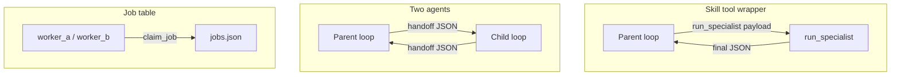

# 14: Skill Wrapper vs Two Agents

After this page a second agent is a choice, not the default. Most of the time the parent should call a function and wait for one JSON result.

## Data
Two shapes exist. They are not the same object.

A **skill / tool wrapper** is a function the parent calls, for example `run_specialist(payload)`. That function runs a script or an in-process loop to completion and returns one JSON object. The parent blocks until the function returns. Chapter 03 `lab1_tool_dispatch` is this shape with a short function body. A specialist skill is the same dispatcher with a longer body.

**Two agents** means each side has its own loop and its own `messages` list. They pass a handoff JSON (the five keys from `01_handoff_protocol.md`) on a queue or as a function argument. `lab2_agent_handoff.py` is the small version: `create_a2a_handoff_payload` then `agent_developer`. `lab1_supervisor_worker.py` is two workers under one supervisor, not a long-lived pair of loops.

The intended host is `OLLAMA_HOST` from the environment (usually `http://127.0.0.1:11434`). The intended model is `OLLAMA_MODEL` from the environment. The intended route is `POST /api/chat`. The shape you pick does not change the host or the port.

## Information
Both shapes isolate context. The parent never needs the child's raw trial-and-error tokens. The difference is whether the parent blocks and waits, or both loops stay alive and pass messages.

A skill wrapper gives you one stack trace. If the child fails, the exception lands in the parent call. Two agents give you two processes (or two loops) and a handoff object. A missing `verification` key fails in `validate_handoff_middleware` before the next POST.

A common production shape is both: the parent sees one skill name in `TOOLS_SCHEMA`. Inside that skill, a full child loop runs and returns one JSON object.

## Knowledge
1. If the child can finish alone (retries, checks, one deliverable), wrap it as a tool. See [00_tool_dispatch.md](../03_the_dispatcher/00_tool_dispatch.md).
2. If the child must stay up, or the parent must approve a mid-run artifact, use two agents and the five-key handoff. See [lab2_agent_handoff.md](./lab2_agent_handoff.md).
3. If two specialist jobs can run at the same time and only the join matters, use hub-and-spoke. See [lab1_supervisor_worker.md](./lab1_supervisor_worker.md).
4. If the work is the same shape and many rows are pending, use many workers on one job table. Volume, not mid-run inspection. See [lab2_two_workers.md](../18_the_job/lab2_two_workers.md).
5. Do not stand up Kafka, Redis, or a gossip bus because you have two job titles. Two job titles still do not require a fleet.

## Wisdom
A function call is enough until you need mid-run inspection or overlapping work. A bus adds routing, serialization, and failure modes that are not this chapter. Two job titles (Architect, Developer) do not require two loops. Two job titles still do not require a fleet.

## The When and Why
- **When (skill):** the task is self-contained. The parent only needs the final payload. You want a simple stack trace.
- **When (two agents):** the parent must watch, correct, or approve work while it is still running, or two loops must run at the same time (watcher vs doer).
- **When (hub-and-spoke):** two specialist jobs can run at the same time and only the join matters.
- **When (job table):** volume. Same work, many pending rows. Not mid-run inspection. See [lab2_two_workers.md](../18_the_job/lab2_two_workers.md).
- **Why:** a bus adds routing, serialization, and failure modes. Skip it until a skill wrapper cannot do the job. Two job titles still do not require a fleet.

## How it works



Walkthrough of the paths:

1. Skill path: the parent emits a tool call named something like `run_specialist`. The dispatcher runs that function. The function POSTs as many times as it needs, then returns `{ "status": "ok", "deliverable": {} }`. The parent reads that object and continues its own loop.
2. Two-agent path: the parent writes a handoff object with `context`, `content`, `action`, `state_dump`, and `verification` under `handoff`. `validate_handoff_middleware` checks the five keys. The child starts from that object (`agent_developer` in lab 2) and POSTs once.
3. Hub-and-spoke path (lab 1): the parent does not wait for a mid-run approval. It `asyncio.gather`s two workers and prints both `{ "role", "output" }` dicts.
4. Job table path (chapter 18 lab 2): many pending rows of the same work. `claim_job(worker)` stores `claimed_by`. A row cannot be claimed twice. No new lab in this folder.

The new fact is the choice. The POST is the same in every path that talks to a model.

## Data contract

**Skill result** (minimum)

```json
{
  "status": "ok",
  "deliverable": {}
}
```

**Intended handoff** (same envelope as `01_handoff_protocol.md`)

```json
{
  "protocol_version": "2026-01-01",
  "correlation_id": "trace-1",
  "handoff": {
    "context": { "goal": "string" },
    "content": { "modified_code": "string" },
    "action": { "instruction": "string" },
    "state_dump": { "checkpoint_id": "string" },
    "verification": { "test_command": "string" }
  }
}
```

**What this page used to show** was a flat object with `context`, `content`, `action`, and `verification` as strings. The lab stores those as nested objects under `handoff`. Use the envelope above.

## Lab
This page is a decision note. It has no new script.

- Decision: [this file](./03_skill_vs_two_agents.md)
- Skill path: [00_tool_dispatch.md](../03_the_dispatcher/00_tool_dispatch.md) / [lab1_tool_dispatch.md](../03_the_dispatcher/lab1_tool_dispatch.md)
- Two-agent path: [lab2_agent_handoff.py](./lab2_agent_handoff.py) / [lab2_agent_handoff.md](./lab2_agent_handoff.md)
- Hub-and-spoke path: [lab1_supervisor_worker.py](./lab1_supervisor_worker.py) / [lab1_supervisor_worker.md](./lab1_supervisor_worker.md)
- Job table path: [lab2_two_workers.md](../18_the_job/lab2_two_workers.md) - many workers, one file. No new lab in this folder.

## Related
- **Subprocess / function call:** the skill wrapper. Lowest overhead.
- **Queue (Redis list, in-memory list):** enough for two agents on one machine. Not in the labs.
- **Kafka / RabbitMQ:** same job when you have many workers or you must not drop messages. Not required for the labs.
- **01_handoff_protocol.md:** the five keys the two-agent path must send.
- **Chapter 18 job table:** many workers on one `jobs.json`. Use for volume, not mid-run inspection.

## Notes
- The decision is the same with any parent and specialist. A second agent is a choice, not a default.
- No paired `.py` on this page. Contract drift is only vs the older flat handoff sketch on this file: the lab uses the nested envelope in `create_a2a_handoff_payload`. Use that envelope.
- Intended host is env / localhost. Do not treat `192.168` as the default.
