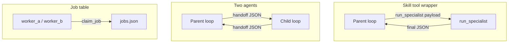

# 14: Skill Wrapper vs Two Agents: Selecting the Right Architecture

By the end of this chapter, you will understand how to choose between wrapping sub-tasks in a synchronous skill tool versus creating a separate autonomous agent process with full handoff protocol support.

Not every specialized task warrants a distinct agent loop. In this chapter, we evaluate the architectural trade-offs between skill function wrappers and multi-agent coordination.

## Data
We compare two key architectural patterns:
1. **Skill / Tool Wrapper**: A standard Python function invoked by the parent agent (e.g. `run_specialist(payload) -> dict`). The parent blocks until the function returns a final JSON deliverable.
2. **Two Autonomous Agents**: Two distinct agent runtimes, each maintaining its own loop and message history, communicating via validated A2A handoff envelopes (the 5 keys: `context`, `content`, `action`, `state_dump`, `verification`).

## Information
Both patterns prevent context pollution by encapsulating sub-task tokens. The primary architectural distinction is lifecycle control:
- **Skill Wrapper**: Simple stack trace, synchronous blocking execution, ideal when sub-tasks can complete reliably without parent oversight.
- **Two Agents**: Asynchronous message passing, ideal when the parent needs to monitor, approve, or steer mid-flight work.

## Knowledge
Here is the decision guide:
1. Use a **Skill Wrapper** when the child task is self-contained and only the final result is required.
2. Use **Two Agents (Peer Handoff)** when work transitions sequentially across distinct role boundaries with strict verification requirements.
3. Use **Hub-and-Spoke** when independent specialist tasks can execute concurrently in parallel.
4. Use a **Job Queue** (Chapter 18) when processing high-volume batches of homogeneous tasks.

## Wisdom
A Python function call is always simpler, faster, and easier to debug than a multi-agent message bus. Only introduce multi-agent handoffs when you need asynchronous oversight or strict permission isolation.

## The When and Why
- **When (Skill)**: Self-contained tasks where you only care about the final JSON output.
- **When (Two Agents)**: Tasks requiring mid-execution human/parent checkpoints or distinct security boundaries.
- **Why**: Multi-agent setups introduce serialization and synchronization overhead. Use the simplest pattern that solves the problem.

## How it works



Walkthrough of the paths:

1. Skill path: the parent emits a tool call named something like `run_specialist`. The dispatcher runs that function. The function POSTs as many times as it needs, then returns `{ "status": "ok", "deliverable": {} }`. The parent reads that object and continues its own loop.
2. Two-agent path: the parent writes a handoff object with `context`, `content`, `action`, `state_dump`, and `verification` under `handoff`. `validate_handoff_middleware` checks the five keys. The child starts from that object (`agent_developer` in lab 2) and POSTs once.
3. Hub-and-spoke path (lab 1): the parent does not wait for a mid-run approval. It `asyncio.gather`s two workers and prints both `{ "role", "output" }` dicts.
4. Job table path (chapter 18 lab 2): many pending rows of the same work. `claim_job(worker)` stores `claimed_by`. A row cannot be claimed twice. No new lab in this folder.

The new fact is the choice. The POST is the same in every path that talks to a model.

## Data contract

**Skill result** (minimum)

```json
{
  "status": "ok",
  "deliverable": {}
}
```

**Intended handoff** (same envelope as `01_handoff_protocol.md`)

```json
{
  "protocol_version": "2026-01-01",
  "correlation_id": "trace-1",
  "handoff": {
    "context": { "goal": "string" },
    "content": { "modified_code": "string" },
    "action": { "instruction": "string" },
    "state_dump": { "checkpoint_id": "string" },
    "verification": { "test_command": "string" }
  }
}
```

**What this page used to show** was a flat object with `context`, `content`, `action`, and `verification` as strings. The lab stores those as nested objects under `handoff`. Use the envelope above.

## Lab
This page is a decision note. It has no new script.

- Decision: [this file](./03_skill_vs_two_agents.md)
- Skill path: [00_tool_dispatch.md](../03_the_dispatcher/00_tool_dispatch.md) / [lab1_tool_dispatch.md](../03_the_dispatcher/lab1_tool_dispatch.md)
- Two-agent path: [lab2_agent_handoff.py](./lab2_agent_handoff.py) / [lab2_agent_handoff.md](./lab2_agent_handoff.md)
- Hub-and-spoke path: [lab1_supervisor_worker.py](./lab1_supervisor_worker.py) / [lab1_supervisor_worker.md](./lab1_supervisor_worker.md)
- Job table path: [lab2_two_workers.md](../18_the_job/lab2_two_workers.md) - many workers, one file. No new lab in this folder.

## Related
- **Subprocess / function call:** the skill wrapper. Lowest overhead.
- **Queue (Redis list, in-memory list):** enough for two agents on one machine. Not in the labs.
- **Kafka / RabbitMQ:** same job when you have many workers or you must not drop messages. Not required for the labs.
- **01_handoff_protocol.md:** the five keys the two-agent path must send.
- **Chapter 18 job table:** many workers on one `jobs.json`. Use for volume, not mid-run inspection.

## Notes
- The decision is the same with any parent and specialist. A second agent is a choice, not a default.
- No paired `.py` on this page. Contract drift is only vs the older flat handoff sketch on this file: the lab uses the nested envelope in `create_a2a_handoff_payload`. Use that envelope.
- Intended host is env / localhost. Do not treat `192.168` as the default.
