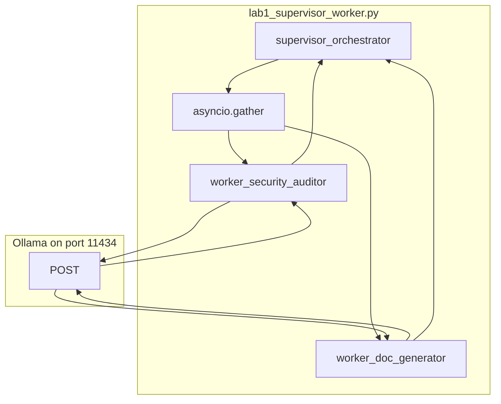

# Lab 1: Supervisor-worker

Two workers run in parallel and the supervisor prints both reports.

## What you touch
- Script: `lab1_supervisor_worker.py`
- Functions: `async_llm_call`, `worker_security_auditor`, `worker_doc_generator`, `supervisor_orchestrator`
- Join: `asyncio.gather` on the two worker coroutines
- Worker return keys: `role`, `output`
- Sample input in `__main__`: the `login` function that builds a SQL string with f-string interpolation
- Intended URL: `{OLLAMA_HOST}/api/chat` (default host `http://192.168.1.29:11434`)
- Reference URL: hardcoded `http://192.168.1.29:11434/api/generate` (see Notes)
- Intended model: `OLLAMA_MODEL` default `qwen3.6:35b-a3b-65k`

## Steps


1. Read `OLLAMA_HOST` and `OLLAMA_MODEL` from the environment. If they are unset, use `http://192.168.1.29:11434` and `qwen3.6:35b-a3b-65k`.
2. Write `async_llm_call(system_prompt, user_prompt)`. Intended POST: `model`, `messages` (`role: system` then `role: user`), `stream: false`, `options.temperature: 0.0` to `{host}/api/chat`. Read assistant `content` (or `response` if you follow the reference route).
3. Write `worker_security_auditor(code_snippet)`. System prompt: security auditor, two bullet points of flaws. Return `{ "role": "Security Auditor", "output": result }`.
4. Write `worker_doc_generator(code_snippet)`. System prompt: tech writer, two bullet points on what the code does. Return `{ "role": "Doc Generator", "output": result }`.
5. Write `supervisor_orchestrator(code_snippet)`. Call `asyncio.gather` on both workers with the same snippet. Print `--- {role} Report ---` and `output` for each item, then the duration.
6. In `__main__`, set `sample_code` to the `login` function that interpolates `user` and `password` into SQL. Call `asyncio.run(supervisor_orchestrator(sample_code))`.
7. Confirm both role headers print. If the host is unreachable, print the error and exit. Do not retry. Do not add a third worker, a Kafka topic, or a tool whitelist.

## Data contract
Intended keys this lab should send and read. The reference file differs (Notes).

**Intended request** (each worker) `POST /api/chat`

```json
{
  "model": "qwen3.6:35b-a3b-65k",
  "messages": [
    { "role": "system", "content": "string" },
    { "role": "user", "content": "string" }
  ],
  "stream": false,
  "options": { "temperature": 0.0 }
}
```

**Worker return**

```json
{
  "role": "Security Auditor",
  "output": "string"
}
```

`role` is `"Security Auditor"` or `"Doc Generator"`.

**Reference script request** `POST /api/generate`

```json
{
  "model": "qwen3.6:35b-a3b-65k",
  "prompt": "You are a Security Auditor. ...\n\nUser Task: def login...",
  "stream": false,
  "options": { "temperature": 0.0 }
}
```

It reads `response` only.

## Run
Copy `.env.example` to `.env` in the repo root and uncomment the Ollama lines. The script loads that file (it does not override vars already set in the shell).

From the repo root:

```bash
python education/14_two_agents/lab1_supervisor_worker.py
```

```powershell
python education/14_two_agents/lab1_supervisor_worker.py
```

## What you should see
`=== STARTING SUPERVISOR-WORKER MULTI-AGENT SWARM ===` and the `login` snippet. `[SUPERVISOR] Dispatching sub-tasks...` then two worker start/finish lines. A `CONSOLIDATED AGENT REPORT` with `--- Security Auditor Report ---` and `--- Doc Generator Report ---`, then `Total Multi-Agent Execution Duration`. If you see `URLError`, the provider is not reachable at the hardcoded host. If only one report prints, `asyncio.gather` did not wait for both coroutines.

## Stop here
Do not add a Kafka bus, a gossip swarm, or a third worker. Do not attach tools or a permission matrix. Chapter 09 isolates tools. Lab 2 in this folder is the peer handoff, not another gather.

## Notes
- Workers share no `messages` list. Each call is its own `prompt` string.
- Contract drift vs `lab1_supervisor_worker.py`: host and model are literals (`OLLAMA_URL`, `MODEL_NAME`), not env. Route is `/api/generate`. System and user text are joined into one `prompt`. No `messages` key and no `tools` key. `temperature` is `0.0`. The print banner says `MULTI-AGENT SWARM`; the topology is hub-and-spoke. The intended contract is two isolated worker POSTs joined by `asyncio.gather`. Write that in your copy. Do not edit the `.py` in the repo.
