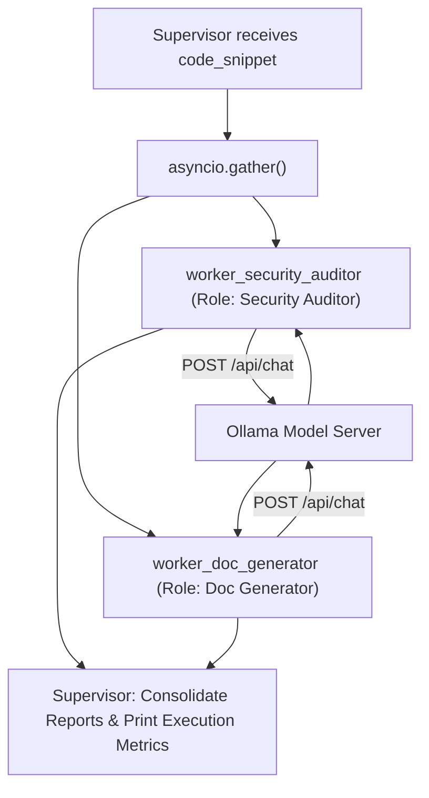

# Lab 1: Building a Supervisor-Worker Hub-and-Spoke Architecture

In this lab, you will build a parallel multi-agent supervisor (`supervisor_orchestrator`) that fans out work concurrently to a `Security Auditor` worker and a `Doc Generator` worker using `asyncio.gather()`, then joins their outputs into a consolidated report.

---

## What you touch
- Script: `lab1_supervisor_worker.py`
- Main Functions:
  - `async_llm_call(system_prompt, user_prompt) -> str`
  - `worker_security_auditor(code_snippet) -> dict`
  - `worker_doc_generator(code_snippet) -> dict`
  - `supervisor_orchestrator(code_snippet) -> list`
- URL / Endpoint: `{OLLAMA_HOST}/api/chat` (defaults to `http://127.0.0.1:11434/api/chat`)
- Target Snippet: Vulnerable `login()` function with SQL f-string interpolation

---

## Steps


1. Read `OLLAMA_HOST` and `OLLAMA_MODEL` from environment variables, defaulting to `http://127.0.0.1:11434` and `llama3.2:1b`.
2. Implement `async_llm_call(system_prompt, user_prompt)` to make non-blocking chat completion POST requests.
3. Implement `worker_security_auditor(code_snippet)`:
   - System persona: Security Auditor focused on vulnerability identification.
   - Return `{"role": "Security Auditor", "output": response_text}`.
4. Implement `worker_doc_generator(code_snippet)`:
   - System persona: Technical Writer focused on clear behavioral documentation.
   - Return `{"role": "Doc Generator", "output": response_text}`.
5. Implement `supervisor_orchestrator(code_snippet)`:
   - Fan out execution concurrently with `await asyncio.gather(...)`.
   - Print consolidated report sections with role headers and elapsed execution time.
6. Execute in `__main__` on the vulnerable SQL login snippet and verify that both reports print.

---

## Data contract

**Worker Return Structure**

```json
{
  "role": "Security Auditor",
  "output": "1. SQL Injection vulnerability in query formatting.\n2. Password stored/passed in plaintext."
}
```

---

## Run
From the repository root, run:

```bash
python education/14_two_agents/lab1_supervisor_worker.py
```

```powershell
python education/14_two_agents/lab1_supervisor_worker.py
```

---

## What you should see
- `=== STARTING SUPERVISOR-WORKER MULTI-AGENT SWARM ===`
- `[SUPERVISOR] Dispatching sub-tasks concurrently...`
- `--- Security Auditor Report ---` highlighting SQL injection vulnerabilities.
- `--- Doc Generator Report ---` explaining authentication function behavior.
- Total execution duration reflecting parallel runtime.

---

## Stop here
You have successfully implemented a parallel hub-and-spoke multi-agent system! In Lab 2, we will implement sequential peer handoffs with strongly typed validation.

Next up: [Lab 2: Agent Handoff](./lab2_agent_handoff.md).

---

## Notes
*(Record your supervisor execution logs and parallel timing here)*

