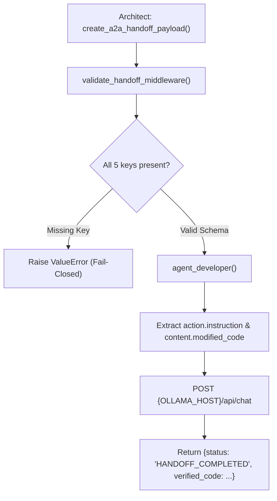

# Lab 2: Implementing the 5-Component Agent Handoff Protocol

In this lab, you will construct a strongly typed 5-component A2A handoff envelope, validate schema integrity using fail-closed middleware, and execute a parameterized SQL refactoring task in the recipient `Developer Agent`.

---

## What you touch
- Script: `lab2_agent_handoff.py`
- Main Functions:
  - `create_a2a_handoff_payload(correlation_id, context_goal, content_artifact, action_instruction, state_checkpoint, verification_cmd) -> dict`
  - `validate_handoff_middleware(payload: dict) -> bool`
  - `agent_developer(payload: dict) -> dict`
- Envelope Structure: `protocol_version`, `correlation_id`, `handoff` (with `context`, `content`, `action`, `state_dump`, `verification`)
- URL / Endpoint: `{OLLAMA_HOST}/api/chat` (defaults to `http://127.0.0.1:11434/api/chat`)
- Target Refactor: Vulnerable SQL string concatenation `query = 'SELECT * FROM users WHERE id=' + user_id`

---

## Steps


1. Read `OLLAMA_HOST` and `OLLAMA_MODEL` from environment variables, defaulting to `http://127.0.0.1:11434` and `llama3.2:1b`.
2. Implement `create_a2a_handoff_payload()` to construct the 5-component envelope.
3. Implement `validate_handoff_middleware(payload)`:
   - Check that `context`, `content`, `action`, `state_dump`, and `verification` all exist under `payload["handoff"]`.
   - Raise `ValueError` if any section is missing.
4. Implement `agent_developer(payload)`:
   - Read `action.instruction` and `content.modified_code`.
   - Prompt the LLM to rewrite the vulnerable SQL string into a parameterized query.
   - Return `{ "correlation_id": correlation_id, "status": "HANDOFF_COMPLETED", "verified_code": response_text, "verification_result": "PASSED" }`.
5. Run the full handoff workflow in `__main__` and verify successful completion.

---

## Data contract

**Handoff Envelope Payload**

```json
{
  "protocol_version": "2026-01-01",
  "correlation_id": "trace-1700000000000",
  "handoff": {
    "context": { "goal": "Fix SQL Injection flaw in legacy query builder.", "environment": "production-database" },
    "content": { "modified_code": "query = 'SELECT * FROM users WHERE id=' + user_id" },
    "action": { "instruction": "Refactor string concatenation to parameterized query.", "deliverable": "secure_query_string" },
    "state_dump": { "checkpoint_id": "chk_db_opt_001", "active_branch": "fix/sql-safety" },
    "verification": { "test_command": "pytest tests/test_sql_security.py", "expected_exit_code": 0 }
  }
}
```

**Developer Return Output**

```json
{
  "correlation_id": "trace-1700000000000",
  "status": "HANDOFF_COMPLETED",
  "verified_code": "cursor.execute('SELECT * FROM users WHERE id = %s', (user_id,))",
  "verification_result": "PASSED"
}
```

---

## Run
From the repository root, run:

```bash
python education/14_two_agents/lab2_agent_handoff.py
```

```powershell
python education/14_two_agents/lab2_agent_handoff.py
```

---

## What you should see
- `=== STARTING 5-COMPONENT AGENT HANDOFF LAB ===`
- `[MIDDLEWARE] Schema Validated! Correlation ID: trace-...`
- `=== DEVELOPER AGENT RECEIVED HANDOFF ===`
- `=== FINAL VERIFIED HANDOFF RESULT ===` showing `HANDOFF_COMPLETED` and the parameterized query fix.

---

## Stop here
You have successfully implemented the 5-component A2A handoff protocol! In Lab 3, we will declare and validate agent capability manifests.

Next up: [Lab 3: Agent Card Manifest](./lab3_agent_card_manifest.md).

---

## Notes
*(Record your handoff execution logs and verified output here)*

