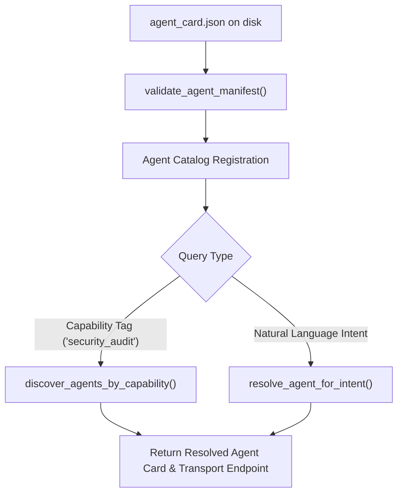

# Lab 3: Agent Capability Manifests and Intent Discovery

In this lab, you will validate machine-readable agent capability manifests (`agent_card.json`), discover agents by capability tags, and dynamically route natural language user intents to the appropriate specialist agent endpoint.

---

## What you touch
- Script: `lab3_agent_card_manifest.py`
- Manifest File: `agent_card.json`
- Main Functions:
  - `validate_agent_manifest(manifest: dict) -> bool`
  - `discover_agents_by_capability(source, capability: str) -> list`
  - `resolve_agent_for_intent(source, intent_description: str) -> dict`
- URL / Endpoint: `{OLLAMA_HOST}/api/generate` (defaults to `http://127.0.0.1:11434/api/generate`)
- Manifest Schema: 8 required fields (`agent_id`, `name`, `version`, `description`, `capabilities`, `skills`, `transport`, `runtime_policy`)

---

## Steps


1. Read `OLLAMA_HOST` and `OLLAMA_MODEL` from environment variables, defaulting to `http://127.0.0.1:11434` and `llama3.2:1b`.
2. Define the Agent Card schema adhering to the 8 required top-level components: `agent_id`, `name`, `version`, `description`, `capabilities`, `skills`, `transport`, and `runtime_policy`.
3. Implement `validate_agent_manifest(manifest)` to enforce schema constraints and reject invalid or incomplete manifests.
4. Load agent card manifests from disk (`agent_card.json`) and in-memory catalogs via `load_manifests_from_source()`.
5. Implement `discover_agents_by_capability(source, capability)` to filter agents by capability keywords.
6. Implement `resolve_agent_for_intent(source, intent_description)` using LLM intent classification to map requests to specialist agents.
7. Return the resolved agent card with actionable transport details (`transport.type`, `transport.endpoint`).

---

## Data contract

**Agent Manifest Schema (`agent_card.json`)**

```json
{
  "agent_id": "agent-sec-01",
  "name": "Security Auditor Agent",
  "version": "1.0.0",
  "description": "Specialized agent for detecting security vulnerabilities, SQL injection, and hardcoded secrets.",
  "capabilities": ["security_audit", "vulnerability_scan", "code_review"],
  "skills": [
    {
      "name": "audit_sql_injection",
      "description": "Analyzes SQL query parameterization defects.",
      "input_schema": { "type": "object", "properties": { "code_snippet": { "type": "string" } } },
      "output_schema": { "type": "object", "properties": { "flaws": { "type": "array" } } }
    }
  ],
  "transport": {
    "type": "http_api",
    "endpoint": "http://127.0.0.1:8001/a2a/v1/invoke"
  },
  "runtime_policy": {
    "timeout_seconds": 60,
    "max_concurrency": 2,
    "requires_human_gate": false
  }
}
```

---

## Run
From the repository root, run:

```bash
python education/14_two_agents/lab3_agent_card_manifest.py
```

```powershell
python education/14_two_agents/lab3_agent_card_manifest.py
```

---

## What you should see
- Manifest validation logs confirming valid schema structures and catching invalid payloads.
- Capability discovery matching `"security_audit"` to the Security Auditor Agent.
- Natural language intent resolution matching `"Scan SQL queries for injection vulnerabilities"` to `Security Auditor Agent`.
- Transport endpoint details displayed for immediate A2A invocation.

---

## Stop here
You have successfully implemented declarative agent manifests and dynamic discovery! In Chapter 15, we will explore the Model Context Protocol (MCP) and dynamic tool loading.

Next up: [Chapter 15: MCP and Skills](../15_mcp_and_skills/00_mcp_and_skills.md).

---

## Notes
*(Record your manifest validation logs and discovery results here)*

