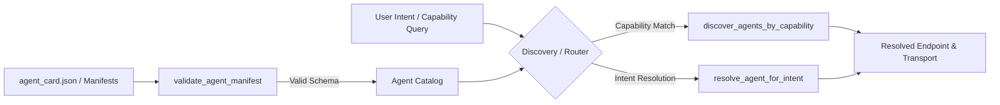

# Lab 3: Agent card manifest

Validate agent capability manifests, discover available agents by capability tag, and dynamically resolve agent endpoints from natural language user intents.
This file is the brief. It is short. It does not reteach the module. Read the module first.

## What you touch
- Script: `lab3_agent_card_manifest.py`
- Manifest file: `agent_card.json`
- Functions: `validate_agent_manifest(manifest)`, `discover_agents_by_capability(source, capability)`, `resolve_agent_for_intent(source, intent_description)`
- URL / path: `{OLLAMA_HOST}/api/generate` (default `http://127.0.0.1:11434/api/generate`)
- Keys sent: `model`, `prompt`, `stream` (`false`), `options.temperature` (`0.0`)
- Keys read: `response`
- Return keys: `agent_id`, `name`, `version`, `capabilities`, `skills`, `transport`, `runtime_policy`

## Steps


1. Read `OLLAMA_HOST` and `OLLAMA_MODEL` from the environment via `load_env()`.
2. Define the Agent Card schema adhering to the 8 required top-level components: `agent_id`, `name`, `version`, `description`, `capabilities`, `skills`, `transport`, and `runtime_policy`.
3. Validate candidate agent manifests using `validate_agent_manifest` ensuring strict typing and schema integrity.
4. Load agent card manifests from disk (`agent_card.json` or directory) and in-memory catalogs via `load_manifests_from_source`.
5. Discover agents providing specific capability tags using `discover_agents_by_capability`.
6. Match natural language intent queries (e.g. "Scan SQL queries for injection vulnerabilities") to specialist agents using `resolve_agent_for_intent`.
7. Return the resolved agent card with actionable transport details (`transport.type`, `transport.endpoint`).

## Data contract
Only the keys this script sends and reads.

**Agent Manifest Schema** (`agent_card.json`)

```json
{
  "agent_id": "agent-sec-01",
  "name": "Security Auditor Agent",
  "version": "1.0.0",
  "description": "Specialized agent for detecting security vulnerabilities, SQL injection, and hardcoded secrets.",
  "capabilities": ["security_audit", "vulnerability_scan", "code_review"],
  "skills": [
    {
      "name": "audit_sql_injection",
      "description": "Analyzes SQL query parameterization defects.",
      "input_schema": { "type": "object", "properties": { "code_snippet": { "type": "string" } } },
      "output_schema": { "type": "object", "properties": { "flaws": { "type": "array" } } }
    }
  ],
  "transport": {
    "type": "http_api",
    "endpoint": "http://127.0.0.1:8001/a2a/v1/invoke"
  },
  "runtime_policy": {
    "timeout_seconds": 60,
    "max_concurrency": 2,
    "requires_human_gate": false
  }
}
```

**Discovery Response**

```json
[
  {
    "agent_id": "agent-sec-01",
    "name": "Security Auditor Agent",
    "transport": {
      "type": "http_api",
      "endpoint": "http://127.0.0.1:8001/a2a/v1/invoke"
    }
  }
]
```

## Run
From the repo root. The script loads `.env` (copy `.env.example` to `.env` first).

```text
python education/14_two_agents/lab3_agent_card_manifest.py
```

## What you should see
Validation results confirming valid schemas and reporting errors on missing fields, discovery finding matching agents for `"security_audit"`, intent resolution matching SQL audit queries to `Security Auditor Agent` and documentation queries to `Tech Writer Agent`, and discovery loading `agent_card.json` from disk. If validation fails unexpectedly, verify that all 8 top-level keys exist.

## Stop here
This lab provides agent manifest discovery and intent resolution primitives. It does not spin up network daemon listeners or execute inter-process RPC calls. Inter-agent handoffs are implemented in Lab 2.

## Notes
- Manifests make agent capabilities machine-discoverable without hardcoding peer identifiers in agent logic.
- Transport decoupling allows agents to expose endpoints over `http_api`, `local_process`, or `stdio` while sharing a uniform discovery contract.
