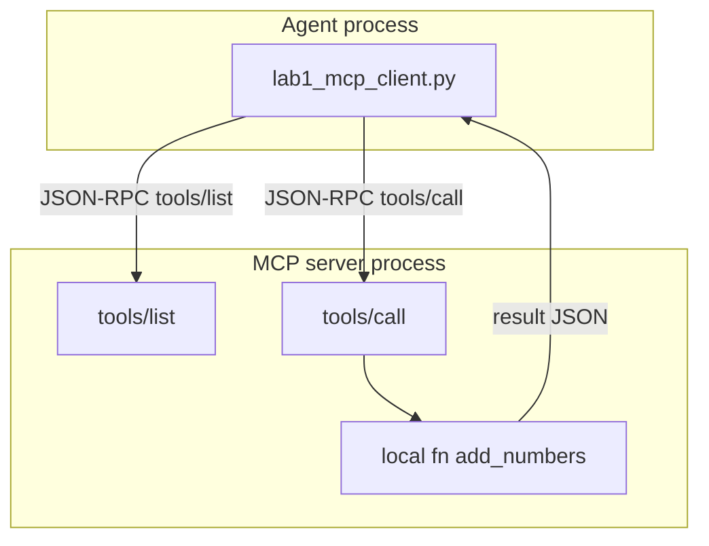

# 15: Model Context Protocol: External Tool Servers via JSON-RPC

By the end of this chapter, you will understand and implement an MCP (Model Context Protocol) client that discovers and invokes tools hosted in separate processes via JSON-RPC 2.0 messages over standard I/O (stdio) or HTTP/SSE.

In Chapter 03, we called local Python functions in the same process. In this chapter, we decouple tools across process boundaries so multiple agents and applications can share the same tool servers.

## Data
**Model Context Protocol (MCP)** standardizes client-server tool interactions using JSON-RPC 2.0:
- **`tools/list`**: Request sent by the agent to discover available tools and their JSON schemas:
  `{"jsonrpc": "2.0", "id": 1, "method": "tools/list", "params": {}}`.
- **`tools/call`**: Request sent by the agent to execute a specific tool with arguments:
  `{"jsonrpc": "2.0", "id": 2, "method": "tools/call", "params": {"name": "add_numbers", "arguments": {"a": 2, "b": 3}}}`.
- **Transports**:
  - **`stdio`**: The agent launches the MCP server as a subprocess, communicating over stdin/stdout lines.
  - **`SSE / HTTP`**: The server listens on an HTTP port, allowing networked remote access.

## Information
In production systems, tools often need to run in dedicated environments with custom dependencies, elevated privileges, or shared database pools.

MCP solves this:
- **Process Isolation**: The tool server runs independently. A crash or hang in a tool does not take down the main agent loop.
- **Shared Utilities**: Multiple agent runtimes can connect to the same MCP server simultaneously.
- **Standard Protocol**: Any MCP-compliant client can use any MCP-compliant tool server without custom integration code.

## Knowledge
Here is the step-by-step procedure:
1. Launch or connect to the target MCP server process.
2. Send a `tools/list` JSON-RPC message and parse available tool definitions.
3. When the LLM generates a tool call, map it to `tools/call` and transmit arguments.
4. Parse the `result` content and format it as a standard observation message for the agent context.

## Wisdom
MCP is a process boundary for running executable code, whereas Skill files (`SKILL.md`) are prompt instructions loaded into context. Keep these two concepts distinct.

## The When and Why
- **When**: When tools have specialized dependencies, require separate security sandbox boundaries, or are shared across multiple services.
- **Why**: In-process tool registries cannot be shared across processes or languages. MCP provides a universal, language-agnostic interface.

## How it works



Walkthrough of one call:

1. The client starts the server (stdio) or opens the server URL (SSE / HTTP).
2. It sends `{ "jsonrpc": "2.0", "id": 1, "method": "tools/list", "params": {} }`.
3. The server replies with a tool named `add_numbers` and an `inputSchema`.
4. The client sends `{ "jsonrpc": "2.0", "id": 2, "method": "tools/call", "params": { "name": "add_numbers", "arguments": { "a": 2, "b": 3 } } }`.
5. The server runs the local function and returns a `result`. The client prints it. The model POST is unchanged.

Nothing in that walkthrough reads a `SKILL.md`. The new work is the process boundary.

## Data contract

**List**

```json
{
  "jsonrpc": "2.0",
  "id": 1,
  "method": "tools/list",
  "params": {}
}
```

**Call**

```json
{
  "jsonrpc": "2.0",
  "id": 2,
  "method": "tools/call",
  "params": { "name": "string", "arguments": {} }
}
```

**Intended result** (shape you print)

```json
{ "name": "add_numbers", "content": "5" }
```

There is no reference `.py` in this folder. The brief is the contract.

## Lab
Done when you have listed one tool from another process and printed one call result.

- Module: [this file](./00_mcp_overview.md)
- Lab 1: [lab1_mcp_client.md](./lab1_mcp_client.md) - brief only; no old script. Write `lab1_mcp_client.py` in the session if you implement it. Keep it small.
- Skills: [01_skills_and_plugins.md](./01_skills_and_plugins.md) - files in the prompt, not RPC.

## Related
- **Chapter 03 registry:** same lookup, same process. This chapter moves the dict across a PID.
- **stdio:** child process, JSON on stdin/stdout. No port.
- **SSE / HTTP:** same methods on a URL.

## Notes
- Skills and plugins (`SKILL.md`) are files loaded into context, not MCP.
- Do not invent a 200-line MCP server script. Brief only. No old script was in the tree.
