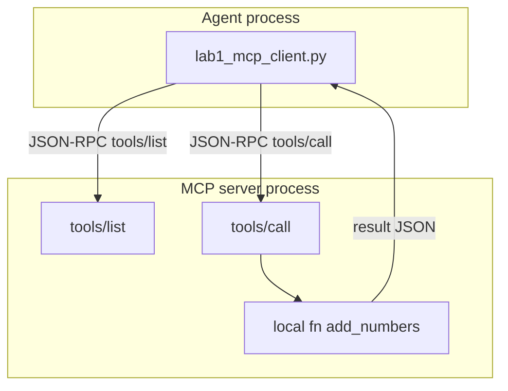

# 15: Model Context Protocol

After this chapter the chapter 03 dispatcher is another process speaking JSON-RPC. Your agent does not import the tool function. It lists tools and calls one by name. This page does not ship a 200-line server.

## Data
**MCP** (Model Context Protocol) is a JSON-RPC conversation between a client (your agent script) and a server (a separate process that owns the functions).

**JSON-RPC** is a JSON object with `jsonrpc` (`"2.0"`), `id` (a number or string), `method` (a string), and `params` (an object). The reply has the same `id` and either `result` or `error`.

Two methods matter here:

1. `tools/list` - the server returns the tool names and schemas it owns.
2. `tools/call` - the client sends `{ "name": "string", "arguments": {} }`. The server runs the local function and returns a JSON result.

Two **transports** move those objects:

- **stdio:** the client starts the server as a child process and writes JSON lines to stdin. The server writes JSON lines to stdout. No port.
- **SSE / HTTP:** the server listens on a port. The client POSTs JSON-RPC to that URL. Same methods, different pipe.

Chapter 03 used `TOOL_REGISTRY[name](**arguments)` in the same PID. MCP is that lookup after a process boundary.

This file was moved from modules/13 and the MCP half of the old tool-use / 01/02 skills pages. `SKILL.md` is not MCP. Skills are `01_skills_and_plugins.md`.

`OLLAMA_HOST` should default to `http://192.168.1.29:11434`. `OLLAMA_MODEL` should default to `qwen3.6:35b-a3b-65k`. The model POST is still chapter 03 (`tools` on `/api/chat`). MCP is the hop from your script to the other process after you read `message.tool_calls`.

## Information
Your agent does not `import` the tool. It calls a server. Two apps can share the same server. An in-process registry cannot do that: each app has its own dict.

The path is: start or attach to a server, send `tools/list`, pick a `name`, send `tools/call`, read the JSON `result`. Then you append `{ "role": "tool", "content": "..." }` the same way chapter 03 did.

This is not RAG-for-tools and not a skill file. A skill is markdown stuffed into the prompt. MCP is a process that runs code.

## Knowledge
1. Start a server (stdio child, or an HTTP listener) that implements `tools/list` and `tools/call` for one function, for example `add_numbers`.
2. From the client, send a JSON-RPC request with `method: "tools/list"`. Read `result.tools` (each item has `name`, `description`, `inputSchema`).
3. Send `method: "tools/call"` with `params: { "name": "add_numbers", "arguments": { "a": 2, "b": 3 } }`.
4. Read `result` (often `{ "content": [{ "type": "text", "text": "5" }] }`). Print the text.
5. Keep the client under 50 lines. Do not invent a 200-line fake server on this page.

## Wisdom
Stop when `tools/list` printed a name and `tools/call` printed a result from another process. Do not add a skill loader, a vector search over schemas, or a full MCP SDK stack here. If you add them now, a miss could come from the RPC, the transport, or the prompt.

## The When and Why
- **When:** tools must live outside the agent PID, or two apps must share the same functions.
- **Why:** the chapter 03 registry is a dict in one process. It cannot be shared across apps.

## How it works



Walkthrough of one call:

1. The client starts the server (stdio) or opens the server URL (SSE / HTTP).
2. It sends `{ "jsonrpc": "2.0", "id": 1, "method": "tools/list", "params": {} }`.
3. The server replies with a tool named `add_numbers` and an `inputSchema`.
4. The client sends `{ "jsonrpc": "2.0", "id": 2, "method": "tools/call", "params": { "name": "add_numbers", "arguments": { "a": 2, "b": 3 } } }`.
5. The server runs the local function and returns a `result`. The client prints it. The model POST is unchanged.

Nothing in that walkthrough reads a `SKILL.md`. The new work is the process boundary.

## Data contract

**List**

```json
{
  "jsonrpc": "2.0",
  "id": 1,
  "method": "tools/list",
  "params": {}
}
```

**Call**

```json
{
  "jsonrpc": "2.0",
  "id": 2,
  "method": "tools/call",
  "params": { "name": "string", "arguments": {} }
}
```

**Intended result** (shape you print)

```json
{ "name": "add_numbers", "content": "5" }
```

There is no reference `.py` in this folder. The brief is the contract.

## Lab
Done when you have listed one tool from another process and printed one call result.

- Module: [this file](./00_mcp_overview.md)
- Lab 1: [lab1_mcp_client.md](./lab1_mcp_client.md) - brief only; no old script. Write `lab1_mcp_client.py` in the session if you implement it. Keep it small.
- Skills: [01_skills_and_plugins.md](./01_skills_and_plugins.md) - files in the prompt, not RPC.

## Related
- **Chapter 03 registry:** same lookup, same process. This chapter moves the dict across a PID.
- **stdio:** child process, JSON on stdin/stdout. No port.
- **SSE / HTTP:** same methods on a URL.

## Notes
- Skills and plugins (`SKILL.md`) are files loaded into context, not MCP.
- Do not invent a 200-line MCP server script. Brief only. No old script was in the tree.
