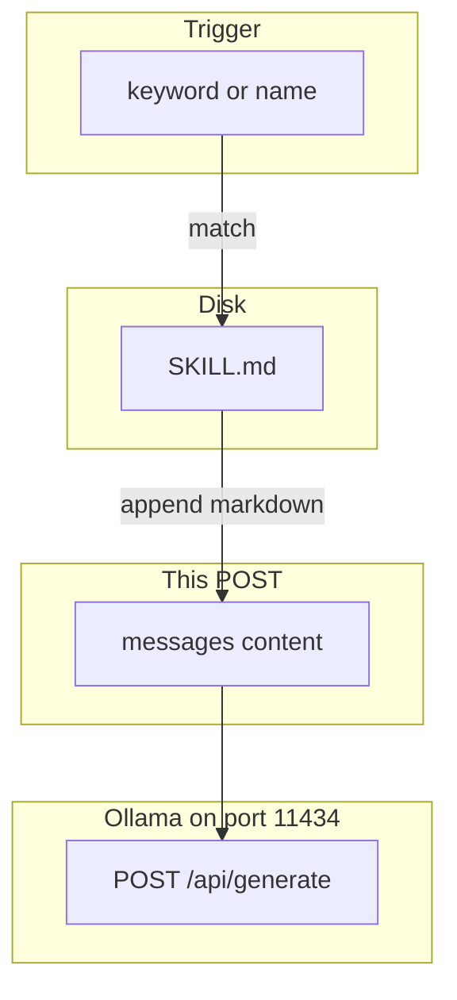

# 15: Skills and Plugins: Dynamic Procedural Prompt Injection

By the end of this chapter, you will understand and implement a dynamic skill loader (`load_skill`) that injects procedural markdown instructions (`SKILL.md`) into prompt context only when specific trigger rules or intent keywords match.

In the previous module, we examined MCP for executing code in external processes. In this module, we examine Skills—which are specialized instructions and guidance documents injected directly into the LLM context.

## Data
A **Skill** represents procedural guidance for specialized workflows:
- **`SKILL.md` File**: A concise markdown document outlining specific rules, checklists, or formatting instructions (e.g. PR code review rules, database migration checklists).
- **Trigger Rule**: A conditional check (such as matching the keyword `"pr-review"` in user input) that dictates when to read and load `SKILL.md`.
- **Dynamic Context Injection**: Appending the skill markdown body to the agent's `role: "system"` message or active turn context.

## Information
Stuffing every available skill, rubric, and guideline into the system prompt on every single turn quickly exhausts the model's context window and increases inference costs.

Dynamic skill loading solves this:
- **On-Demand Loading**: Unused skill documents remain dormant on disk.
- **Selective Injection**: Only the specific instructions relevant to the immediate user prompt are injected into context.
- **Context Economy**: Keeps prompt sizes lean, fast, and focused.

## Knowledge
Here is the step-by-step procedure:
1. Author focused procedural skill guides (e.g. `SKILL.md`).
2. Implement a trigger evaluator (`load_skill(user_text, skill_path)`).
3. If trigger criteria are met, read `SKILL.md` and return `{"loaded": True, "path": path, "body": content}`.
4. If no triggers match, return `{"loaded": False}` without reading the filesystem.
5. Append loaded skill text to system or user messages for inference.

## Wisdom
Remember: MCP is for running code; Skills are for providing instructions. Load skills just-in-time when triggered rather than bloating every conversation.

## The When and Why
- **When**: Specialized multi-step tasks (e.g. style guides, code reviews, release checklists) that apply only to specific user requests.
- **Why**: Static prompts containing every possible instruction degrade model focus and waste token budgets. Dynamic loading provides surgical instruction injection.

## How it works



Walkthrough of one load:

1. The user text matches a trigger (for example the word `pr-review`).
2. You read `SKILL.md` as a string.
3. You append that string to the system `content` (or to the user `content`).
4. You POST the updated `messages` to `{OLLAMA_HOST}/api/generate` or `/v1/chat/completions`.
5. Unused skill files stay on disk. They are not in this POST.

Walkthrough of lab 2:

1. `SKILL.md` holds `# PR review` and `Check the diff. List risks. Do not merge.`
2. `load_skill("Please do a pr-review on this branch", path)` returns `{ "loaded": true, "path", "body" }`.
3. `load_skill("What is 2+2?", path)` returns `{ "loaded": false }` and does not open the file.
4. No POST. No `tools/list`.

Nothing in that walkthrough opens a JSON-RPC socket. The new work is the file in the prompt.

## Data contract

**Skill body** (intended)

```json
{ "path": "SKILL.md", "body": "markdown string" }
```

**Lab 2 match**

```json
{ "loaded": true, "path": "SKILL.md", "body": "# PR review\nCheck the diff. List risks. Do not merge.\n" }
```

**Request after load** `POST /v1/chat/completions` (or flatten into `prompt` on `/api/generate`)

```json
{
  "model": "qwen3.6:35b-a3b-65k",
  "messages": [
    { "role": "system", "content": "{SKILL.md body}" },
    { "role": "user", "content": "string" }
  ]
}
```

Lab 2 prints the body and does not POST. The intended contract is still a markdown string in `content`.

## Lab
Done when a `pr-review` line prints the `SKILL.md` body and a math line prints `skipped`.

- Module: [this file](./01_skills_and_plugins.md)
- Lab 2: [lab2_skills.md](./lab2_skills.md) - write `lab2_skills.py` and `SKILL.md`. Trigger `pr-review`. Done when the body prints on a match and the miss does not open the file.
- Lab 1 (this folder): [lab1_mcp_client.md](./lab1_mcp_client.md) - JSON-RPC, not a file load.

## Related
- **Chapter 13 procedural memory:** the same file idea. This page is the load step.
- **00_mcp_overview.md:** a process, not a markdown file.

## Notes
- MCP half of the old tool-use page is on `00_mcp_overview.md`.
- Lab 2 has no reference `.py` yet. Do not treat lab 1 as the skills lab. Do not edit the `.py` files in the repo.
