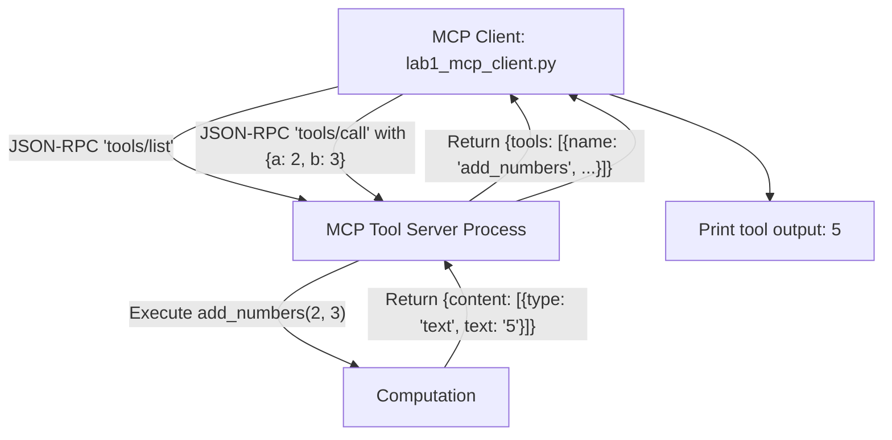

# Lab 1: Building a Lightweight MCP Client via JSON-RPC 2.0

In this lab, you will implement a lightweight Model Context Protocol (MCP) client `lab1_mcp_client.py` that sends standard JSON-RPC 2.0 requests (`tools/list` and `tools/call`) to an external tool process over stdio/IPC and prints the returned result.

---

## What you touch
- Script: `lab1_mcp_client.py`
- MCP JSON-RPC Methods: `tools/list`, `tools/call`
- Target Tool: `add_numbers(a, b) -> int`
- Transport: Standard I/O (stdio child process) or IPC pipe
- Expected Result: Discovered tool name (`add_numbers`) and calculated call output (`"5"`)

---

## Steps


1. Implement a lightweight client communicating with an external tool server via JSON-RPC 2.0.
2. Send the discovery request:
   `{"jsonrpc": "2.0", "id": 1, "method": "tools/list", "params": {}}`.
3. Parse the returned `result.tools` list and confirm discovery of `add_numbers`.
4. Send the execution request:
   `{"jsonrpc": "2.0", "id": 2, "method": "tools/call", "params": {"name": "add_numbers", "arguments": {"a": 2, "b": 3}}}`.
5. Extract and print the returned text payload (`"5"`).

---

## Data contract

**Discovery Request (`tools/list`)**

```json
{
  "jsonrpc": "2.0",
  "id": 1,
  "method": "tools/list",
  "params": {}
}
```

**Call Request (`tools/call`)**

```json
{
  "jsonrpc": "2.0",
  "id": 2,
  "method": "tools/call",
  "params": {
    "name": "add_numbers",
    "arguments": { "a": 2, "b": 3 }
  }
}
```

**MCP Result Payload**

```json
{
  "jsonrpc": "2.0",
  "id": 2,
  "result": {
    "content": [
      { "type": "text", "text": "5" }
    ]
  }
}
```

---

## Run
From the repository root, run:

```bash
python education/15_mcp_and_skills/lab1_mcp_client.py
```

```powershell
python education/15_mcp_and_skills/lab1_mcp_client.py
```

---

## What you should see
- `Discovered tool: add_numbers`
- `Executed tool call result: 5`

---

## Stop here
You have successfully implemented an external MCP client! In Lab 2, we will build a dynamic just-in-time skill loader.

Next up: [Lab 2: Skills and Plugins](./lab2_skills.md).

---

## Notes
*(Record your MCP JSON-RPC transaction logs here)*

