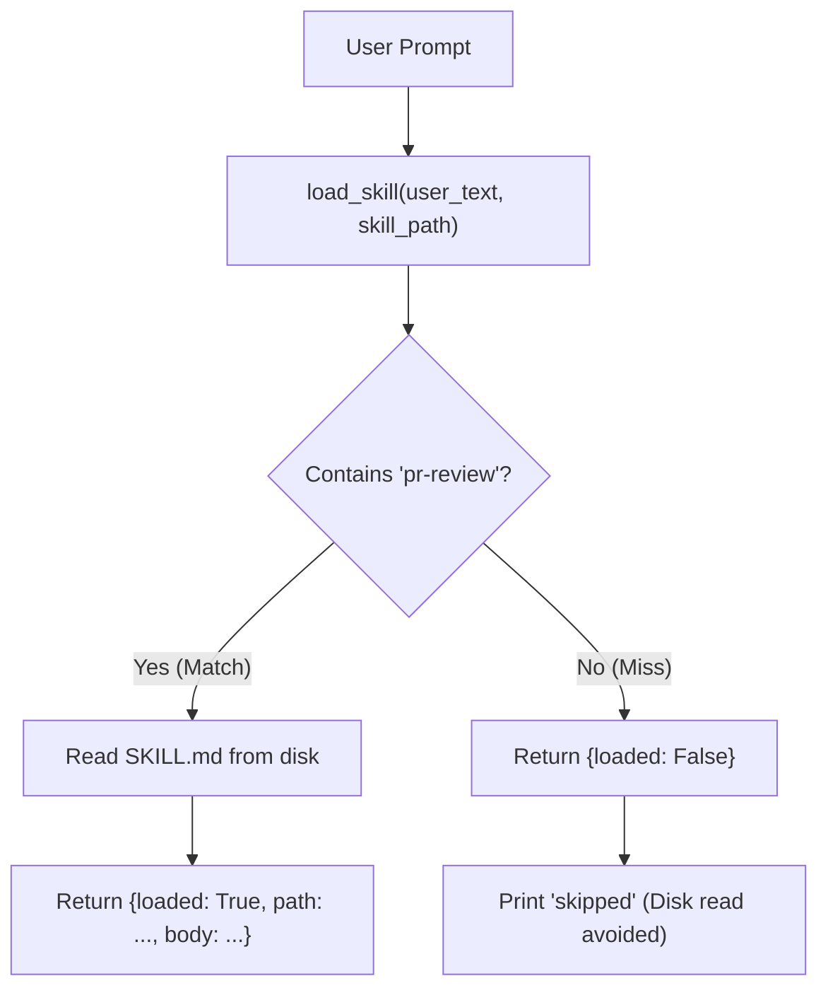

# Lab 2: Loading Dynamic Procedural Skills on Demand

In this lab, you will write a dynamic skill loader `load_skill()` that parses a target skill guide (`SKILL.md`) only when the user query matches an active trigger keyword (`pr-review`), skipping unnecessary filesystem reads on unmatched prompts.

---

## What you touch
- Script to create: `lab2_skills.py`
- Skill File: `SKILL.md` (next to the script)
- Trigger Keyword: `"pr-review"`
- Main Function: `load_skill(user_text: str, skill_path: str) -> dict`
- Test Queries:
  - Match: `"Please do a pr-review on this branch"`
  - Miss: `"What is 2+2?"`

---

## Steps


1. Create `SKILL.md` next to the script with the following contents:
   ```markdown
   # PR review
   Check the diff. List risks. Do not merge.
   ```
2. Implement `load_skill(user_text: str, skill_path: str) -> dict`:
   - If `"pr-review"` is not in `user_text`, immediately return `{"loaded": False}` without reading disk.
   - If `"pr-review"` is present, read `SKILL.md` and return `{"loaded": True, "path": skill_path, "body": file_content}`.
3. In `__main__`:
   - Test with `"Please do a pr-review on this branch"` and verify that the skill body is returned and printed.
   - Test with `"What is 2+2?"` and verify that execution prints `"skipped"`.

---

## Data contract

**`SKILL.md` Body Content**

```text
# PR review
Check the diff. List risks. Do not merge.
```

**Skill Match Return Object**

```json
{
  "loaded": true,
  "path": "education/15_mcp_and_skills/SKILL.md",
  "body": "# PR review\nCheck the diff. List risks. Do not merge.\n"
}
```

**Skill Miss Return Object**

```json
{
  "loaded": false
}
```

---

## Run
From the repository root, run:

```bash
python education/15_mcp_and_skills/lab2_skills.py
```

```powershell
python education/15_mcp_and_skills/lab2_skills.py
```

---

## What you should see
- `Trigger: pr-review`
- `Path: .../SKILL.md`
- `Body: # PR review\nCheck the diff. List risks. Do not merge.`
- `Result for 'What is 2+2?': skipped`

---

## Stop here
You have successfully implemented dynamic on-demand skill loading! In Chapter 16, we will build security sandboxes, RBAC permissions, and prompt injection defenses.

Next up: [Chapter 16: The Shield](../16_the_shield/01_security_overview.md).

---

## Notes
*(Record your skill loading trace and trigger verification results here)*

