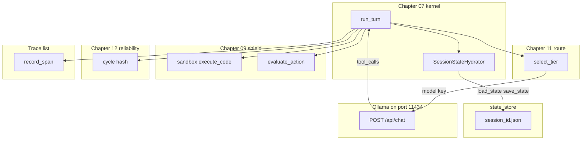

# 15: Harness synthesis

After this page the pieces from chapters 07–14 sit in one host process: hydrate, route, sandbox, cycle, HITL, and trace. This page does not add a new primitive.

## Data
A **harness** here is one Python process that already owns the chapter 07 kernel and then calls functions you already wrote.

The pieces, by name:

- **hydrate:** `SessionStateHydrator` in `education/07_one_agent/lab1_core_harness_kernel.py`. Functions `load_state(session_id)` and `save_state(session_id, state)`. File `state_store/{session_id}.json`. Keys: `session_id`, `messages`, `turn_count`.
- **route:** `triage_prompt_intent` / `select_tier` from chapter 11. Sets the JSON `model` key before the POST.
- **sandbox:** `execute_sandboxed_python` from chapter 09, or `SandboxedSubprocessWorker.execute_code` in this folder's `lab2_resilient_executor.py`. Child process, temp dir, timeout.
- **cycle:** `compute_step_hash` / `CycleOscillationDetector.check_call_signature` from chapter 12. Same tool name plus args (and often the same error hash) stops the loop.
- **HITL:** `evaluate_action` from chapter 09. A mutative command returns `PAUSED_FOR_HITL_APPROVAL` instead of running.
- **trace:** a list of span dicts (`session_id`, `span_name`, `duration_ms`, `attributes`). Chapter 12 evals and this folder's `OTelEvalTracer.record_span` already do that.

Lab 1 of the kernel is already in chapter 07 (`lab1_core_harness_kernel.py`). This page's labs are `lab2_resilient_executor.py` and `lab3_enterprise_harness_app.py`. They were moved from the old `modules/11` tree.

`OLLAMA_HOST` should default to `http://192.168.1.29:11434`. `OLLAMA_MODEL` should default to `qwen3.6:35b-a3b-65k`. The intended model route is still `POST /api/chat` with `messages` and `tool_calls`.

## Information
Do not start the path here. Open this folder after you have run 00–14. Each script in 00–14 is one piece. This page wires those pieces in one process so a session file, a model pick, a sandbox, a cycle halt, an approval gate, and a span list share the same `session_id`.

Scattered scripts are not a product. One host that calls `run_turn`, then `select_tier`, then `execute_code`, then `evaluate_action`, then `record_span` is the product shape. A browser demo app is optional and is not added in this PR.

Do not invent a new loop, a new protocol, or a new store. If a piece is missing, go back to its chapter.

## Knowledge
1. List the pieces you already have: hydrate, route, sandbox, cycle, HITL, trace.
2. Keep the chapter 07 kernel as the host. `run_turn(session_id, user_prompt)` still loads and saves `state_store/{session_id}.json`.
3. Before the POST, call the chapter 11 router so `model` is a chosen id, not a constant.
4. When a tool wants to run code, call the chapter 09 sandbox. When a tool wants a mutative command, call the chapter 09 HITL gate.
5. After each tool step, run the chapter 12 cycle hash. If it repeats, halt.
6. Append a span dict for the POST and for the gate. Do not add a new advanced topic.

## Wisdom
Do not add a new primitive; compose what you already have. A second kernel, a new RPC, or a new database would hide which old piece broke. Stop when one process has called hydrate, route, sandbox, cycle, HITL, and trace on the same session.

## The When and Why
- **When:** you have finished 00–14 and the scripts still live in separate folders.
- **Why:** scattered scripts are not a product. One host is how a session, a model pick, and a gate share state.

## How it works



Walkthrough of one composed turn:

1. `run_turn` loads `state_store/{session_id}.json` (or starts `{ session_id, messages: [], turn_count: 0 }`).
2. `select_tier` (or `triage_prompt_intent`) picks `FAST_TIER` or `DEEP_TIER` and sets `model`.
3. The script POSTs `model`, `messages`, `tools`, `stream: false` to `{OLLAMA_HOST}/api/chat`.
4. If `message.tool_calls` asks to run code, `execute_code` starts a child process. If the command is mutative, `evaluate_action` returns `PAUSED_FOR_HITL_APPROVAL`.
5. `check_call_signature` or `compute_step_hash` records the tool name and args. A repeat aborts.
6. `record_span` appends `{ session_id, span_name, duration_ms, attributes }`. `save_state` writes the file.

Nothing in that walkthrough is a new class of object. The new fact is that those calls share one process and one `session_id`.

## Data contract

**Intended session JSON** (`state_store/{session_id}.json`)

```json
{
  "session_id": "string",
  "messages": [],
  "turn_count": 0
}
```

**Intended model request** `POST /api/chat`

```json
{
  "model": "qwen3.6:35b-a3b-65k",
  "messages": [],
  "tools": [],
  "stream": false,
  "options": { "temperature": 0.0 }
}
```

The assistant message may include `tool_calls`. That is the same key as chapter 03.

**Intended `run_turn` return**

```json
{
  "session_id": "string",
  "turn_count": 0,
  "thinking": "string",
  "response": "string"
}
```

**What `lab2_resilient_executor.py` actually returns** (no HTTP)

```json
{
  "status": "SUCCESS",
  "attempts": 2,
  "stdout": "5",
  "final_code": "string"
}
```

**What `lab3_enterprise_harness_app.py` actually returns**

```json
{
  "status": "PAUSED_FOR_HITL_APPROVAL",
  "session_id": "ent_session_701",
  "selected_tier": "DEEP_TIER",
  "llm_response": "string",
  "safety_eval": {},
  "total_duration_ms": 0.0,
  "telemetry_spans": []
}
```

See Notes.

## Lab
Done when one process has reused hydrate, route, sandbox, cycle, HITL, and trace. Do not add a new primitive.

- Module: [this file](./00_harness_overview.md)
- Lab 1: already in chapter 07, [lab1_core_harness_kernel.py](../07_one_agent/lab1_core_harness_kernel.py) / [lab1_core_harness_kernel.md](../07_one_agent/lab1_core_harness_kernel.md) — hydrate. Done when turn 2 remembers the name.
- Lab 2: [lab2_resilient_executor.py](./lab2_resilient_executor.py) / [lab2_resilient_executor.md](./lab2_resilient_executor.md) — sandbox plus cycle plus a mock fix. Done when a ZeroDivisionError run returns `SUCCESS` after a second attempt.
- Lab 3: [lab3_enterprise_harness_app.py](./lab3_enterprise_harness_app.py) / [lab3_enterprise_harness_app.md](./lab3_enterprise_harness_app.md) — route plus HITL plus spans. Done when `ent_session_701` prints `DEEP_TIER` and `PAUSED_FOR_HITL_APPROVAL`.
- Other projects in this folder (workbench, SQL, SRE, spec TDD, serving) are [01_project_blueprints.md](./01_project_blueprints.md) and [02_spec_tdd.md](./02_spec_tdd.md).

## Related
- **Chapter 07:** the kernel this wraps (`run_turn`, `SessionStateHydrator`).
- **Chapter 09:** sandbox and HITL.
- **Chapter 11:** the router that sets `model`.
- **Chapter 12:** cycle hash and reflexion.
- **01_project_blueprints.md:** extra vertical slices. Not required to finish this page.

## Notes
- Moved from the old `modules/11` tree. Lab 1 stayed in chapter 07 on purpose.
- A demo UI is optional and is not added in this PR.
- Do not commit `state_store` dumps.
- Contract drift vs `lab2_resilient_executor.py`: no `OLLAMA_HOST` / `OLLAMA_MODEL`, no POST, no session file, no `tool_calls`. Cycle key is `execute_code` plus `code_len`. Error halt is an MD5 of `stderr`. The fixer is `mock_llm_fixer`, not a model. Return keys are `status`, `attempts`, `stdout`, `final_code` (or `reason` on abort).
- Contract drift vs `lab3_enterprise_harness_app.py`: host and models are literals (`http://192.168.1.29:11434/api/generate`, `qwen3.6:35b-a3b-65k`, `qwen2.5:7b`). Route is `/api/generate`, not `/api/chat`. No `messages`, no `tools`, no session file write. `process_request` takes `proposed_action` from the caller, not from `tool_calls`. Spans live only in the return dict.
- The intended contract on this page is the chapter 07 session JSON plus `tool_calls` on `/api/chat`, with the old pieces called from one host. Write that in your copy. Leave the reference files as-is.
