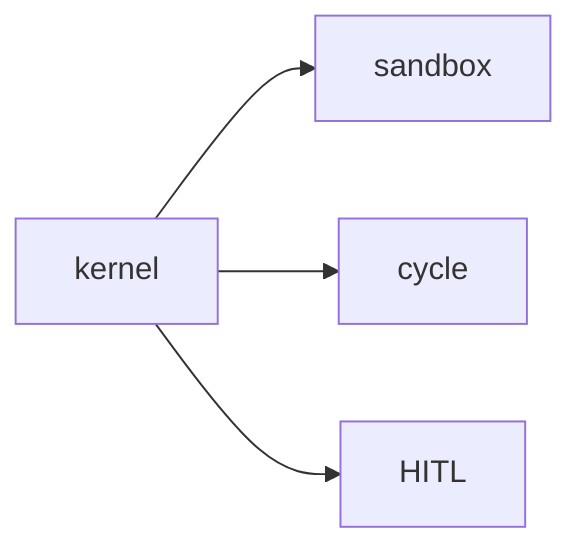

# 15: Harness synthesis

After this page the pieces from 07–14 sit in one host: hydrate, route, sandbox, cycle, HITL, trace.

## Data
- Moved from modules/11
- Labs: `lab2_resilient_executor`, `lab3_enterprise_harness_app` (lab1 already in 07)

## Information
Do not start here. Snap pieces you already ran.

## Knowledge
1. List the pieces you have.
2. Wire them in one process.
3. Do not add a new advanced topic.

## Wisdom
A demo app is optional and not added in this PR.

## The When and Why
- **When:** you have finished 00–14.
- **Why:** scattered scripts are not a product.

## How it works

## Data contract
Same session JSON + tool_calls.

## Lab
- [lab2_resilient_executor.py](./lab2_resilient_executor.py) / [lab2_resilient_executor.md](./lab2_resilient_executor.md)
- [lab3_enterprise_harness_app.py](./lab3_enterprise_harness_app.py) / [lab3_enterprise_harness_app.md](./lab3_enterprise_harness_app.md)

## Related
- **Chapter 07:** the kernel this wraps.

## Notes
Do not commit state_store dumps.
