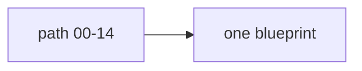

# 15: Project blueprints

After this page the old module 09 projects are extra synthesis work, not a new science.

## Data
- Workbench, SQL agent, SRE agent, serving infra
- Moved from modules/09 and labs/09
- Spec TDD from 04/02 + lab3_spec_tdd_loop
- Self-evolution 04/03 as module-only
- Generative UI 05/02 if not already in 09

## Information
These reuse chapters 06–10. Do not invent new stacks.

## Knowledge
1. Pick one blueprint.
2. Reuse existing labs.
3. Keep scripts as reference solutions.

## Wisdom
Blueprints are optional after the path.

## The When and Why
- **When:** you want a vertical slice.
- **Why:** the path already taught the pieces.

## How it works

## Data contract
Use each lab's own contract.

## Lab
- [lab1_multi_agent_workbench.py](./lab1_multi_agent_workbench.py) / [lab1_multi_agent_workbench.md](./lab1_multi_agent_workbench.md)
- [lab2_enterprise_sql_agent.py](./lab2_enterprise_sql_agent.py) / [lab2_enterprise_sql_agent.md](./lab2_enterprise_sql_agent.md)
- [lab3_autonomous_sre_agent.py](./lab3_autonomous_sre_agent.py) / [lab3_autonomous_sre_agent.md](./lab3_autonomous_sre_agent.md)
- [lab4_agent_serving_infra.py](./lab4_agent_serving_infra.py) / [lab4_agent_serving_infra.md](./lab4_agent_serving_infra.md)
- [lab3_spec_tdd_loop.py](./lab3_spec_tdd_loop.py) / [lab3_spec_tdd_loop.md](./lab3_spec_tdd_loop.md)

## Related
- **PATH.md:** the required line is 00–15, not these names.

## Notes
Self-evolution is module-only; no fake lab.
