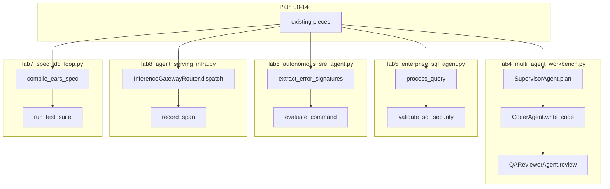

# 15: Project blueprints

After this page the old module 09 projects are extra synthesis work, not a new science. Each blueprint reuses chapters 06–14. This page does not add a new primitive.

## Data
A **blueprint** is one vertical slice: a script that calls pieces you already ran, aimed at one job (workbench, SQL, SRE, serving, spec TDD).

The five scripts in this folder, and the pieces they reuse:

- **Workbench** (`lab4_multi_agent_workbench.py`): `SupervisorAgent.plan`, `CoderAgent.write_code`, `QAReviewerAgent.review`. Chapter 08 handoff (three roles in one process). Chapter 09 sandbox (`subprocess.Popen` in a `workbench_` temp dir). Chapter 01 POST. Files written: `calculator.py`, `test_calculator.py`.
- **SQL agent** (`lab5_enterprise_sql_agent.py`): `EnterpriseSQLAgent.process_query`, `validate_sql_security`, `init_sample_database`. Chapter 02 JSON/SQL text. Chapter 09 keyword block (`DROP`, `DELETE`, and the rest). Chapter 12 reflexion (feed `sqlite3.OperationalError` back). In-memory SQLite tables `users` and `orders`.
- **SRE agent** (`lab6_autonomous_sre_agent.py`): `LogTriageEngine.extract_error_signatures`, `SRECommandSafetyGuard.evaluate_command`, `AutonomousSREAgent.investigate_and_remediate`. Chapter 13 filter (keep `ERROR` / `CRITICAL` / `FATAL`). Chapter 09 HITL (`REQUIRES_HITL_APPROVAL`, `FORBIDDEN`). Chapter 06 phases (triage, then RCA, then gate).
- **Serving infra** (`lab8_agent_serving_infra.py`): `InferenceGatewayRouter.dispatch`, `OTelSpanCollector.record_span`, `ProductionAgentServingRuntime.handle_request`. Chapter 11 gateway (endpoint list). Chapter 12 / 00 trace (`telemetry_spans`). Chapter 10 request handle. Session id `tenant_session_9921`.
- **Spec TDD** (`lab7_spec_tdd_loop.py`): `compile_ears_spec`, `run_test_suite`, `run_spec_tdd_pipeline`. Chapter 02 contract (EARS lines). Chapter 09 sandbox (temp dir `sdd_tdd_`, files `test_suite.py` and `solution.py`). Also taught on [02_spec_tdd.md](./02_spec_tdd.md).

Moved from the old `modules/09` and `labs/09` trees. Spec TDD also came from old `modules/04/02`. Self-evolution is [03_self_evolution.md](./03_self_evolution.md) (module only, no lab). Generative UI already lives in chapter 09 (`lab3_hitl_generative_ui.py`).

`OLLAMA_HOST` should default to `http://192.168.1.29:11434`. `OLLAMA_MODEL` should default to `qwen3.6:35b-a3b-65k`.

## Information
These reuse chapters 06–14. Do not invent new stacks. A workbench is chapter 08 roles plus a sandbox. A SQL agent is a POST plus a keyword check plus SQLite. An SRE agent is a filter plus a HITL gate. Serving is a POST plus a span list. Spec TDD is a failing test then a fix.

PATH.md is the required line (00–15). These names are optional after that line.

Keep the `.py` files as reference solutions. Rewrite from the brief if you want. Do not add a new protocol or a new store.

## Knowledge
1. Pick one blueprint. Do not run all five as a required set.
2. Name the old pieces that blueprint calls (file, function, JSON key).
3. Reuse those labs. Wire them in one process.
4. Keep the scripts as reference solutions.
5. Do not invent a new stack.

## Wisdom
Do not add a new primitive; compose what you already have. Blueprints are optional after the path. If you add a new topology here, a failure could come from the old piece or from the extra.

## The When and Why
- **When:** you want a vertical slice after 00–14.
- **Why:** the path already taught the pieces. A blueprint is those pieces aimed at one job.

## How it works



Walkthrough of picking one blueprint:

1. Finish 00–14. The required line in PATH.md stops at this chapter, not at these names.
2. Pick one script. Example: workbench. `SupervisorAgent.plan` returns two task strings. `CoderAgent.write_code` POSTs `/api/generate` and writes `calculator.py` then `test_calculator.py` in a `workbench_` temp dir. `QAReviewerAgent.review` runs `test_calculator.py` with `subprocess.Popen`.
3. The other four scripts are the same idea with different old pieces. SQL uses `validate_sql_security` and `sqlite3`. SRE uses `extract_error_signatures` and `evaluate_command`. Serving uses `dispatch` and `record_span`. Spec TDD uses `compile_ears_spec` then a red test then a green fix.
4. Self-evolution has no lab. Generative UI is already in chapter 09.

Nothing in that walkthrough is a new class of object.

## Data contract

Use each lab's own contract. Intended shared shape is still the chapter 07 session JSON plus `tool_calls` on `POST /api/chat`. Defaults: `OLLAMA_HOST` `http://192.168.1.29:11434`, `OLLAMA_MODEL` `qwen3.6:35b-a3b-65k`.

**What the reference scripts actually send** (when they POST)

```json
{
  "model": "qwen3.6:35b-a3b-65k",
  "prompt": "string",
  "stream": false,
  "options": { "temperature": 0.0 }
}
```

They read `response`. Host and model are literals. Route is `/api/generate`. See Notes and each lab brief.

## Lab
Done when you have run one blueprint and can name the old pieces it called. Do not add a new primitive.

- Module: [this file](./01_project_blueprints.md)
- [lab4_multi_agent_workbench.py](./lab4_multi_agent_workbench.py) / [lab4_multi_agent_workbench.md](./lab4_multi_agent_workbench.md) — supervisor, coder, QA. Done when `test_calculator.py` prints a pass or a traceback.
- [lab5_enterprise_sql_agent.py](./lab5_enterprise_sql_agent.py) / [lab5_enterprise_sql_agent.md](./lab5_enterprise_sql_agent.md) — text to SQL plus a keyword block. Done when scenario 1 returns rows and scenario 2 returns `SECURITY_REJECTED`.
- [lab6_autonomous_sre_agent.py](./lab6_autonomous_sre_agent.py) / [lab6_autonomous_sre_agent.md](./lab6_autonomous_sre_agent.md) — log filter plus HITL. Done when you see `READ_ONLY`, `REQUIRES_HITL_APPROVAL`, and `FORBIDDEN`.
- [lab8_agent_serving_infra.py](./lab8_agent_serving_infra.py) / [lab8_agent_serving_infra.md](./lab8_agent_serving_infra.md) — POST plus spans. Done when `tenant_session_9921` prints `llm.inference` and `sandbox.execution`.
- [lab7_spec_tdd_loop.py](./lab7_spec_tdd_loop.py) / [lab7_spec_tdd_loop.md](./lab7_spec_tdd_loop.md) — EARS spec, red test, green fix. Also [02_spec_tdd.md](./02_spec_tdd.md).
- Self-evolution: [03_self_evolution.md](./03_self_evolution.md). Module only. No lab.

## Related
- **PATH.md:** the required line is 00–15, not these names.
- **Chapter 08:** workbench roles.
- **Chapter 09:** sandbox and HITL (including generative UI).
- **00_harness_overview.md:** the host those pieces sit in.

## Notes
- Moved from old `modules/09` and `labs/09`. Spec TDD also from old `modules/04/02`. Self-evolution is module-only; no fake lab.
- Generative UI is already in chapter 09 (`lab3_hitl_generative_ui.py`). Do not add a second copy here.
- Harness pairs stay lab2 / lab3. Blueprints are lab4 workbench, lab5 SQL, lab6 SRE, lab7 spec TDD, lab8 serving.
- Contract drift is per script: most hardcode `http://192.168.1.29:11434/api/generate` and `qwen3.6:35b-a3b-65k`, send `prompt` not `messages`, and skip session JSON. Workbench and spec TDD use a temp dir, not `state_store`. Serving simulates sandbox with `time.sleep(0.05)` and does not start a child. Spec TDD calls the model only for the EARS spec; the red and green files are literals. The intended contract is each lab's own brief, composed from old pieces. Write that in your copy. Leave the reference files as-is.
