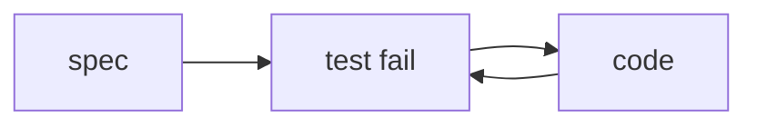

# 15: Spec-driven TDD

After this page a spec file drives a red/green loop.

## Data
- Moved from modules/04/02 and labs/04/lab3_spec_tdd_loop

## Information
Write the check first, then the code.

## Knowledge
1. Spec.
2. Failing test.
3. Agent or you write code.
4. Re-run.

## Wisdom
Not a new agent type.

## The When and Why
- **When:** you have acceptance text.
- **Why:** code-first skips the contract.

## How it works

## Data contract
spec: markdown or JSON assertions

## Lab
See lab3_spec_tdd_loop.

## Related
- **Chapter 12 evals:** the score.

## Notes
Moved as specified.
