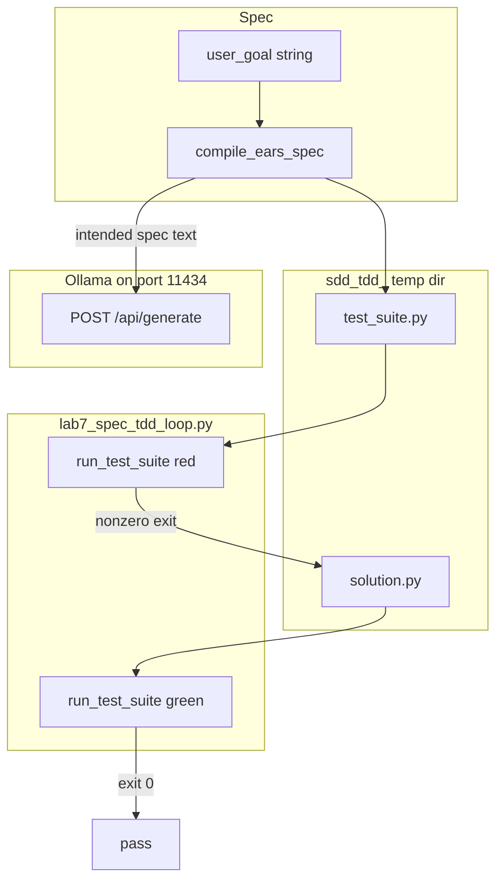

# 15: Spec-driven TDD

After this page a spec file drives a red/green loop. This is not a new agent type. This page does not add a new primitive.

## Data
A **spec** is acceptance text written before the code. It can be markdown, JSON assertions, or EARS lines (`WHEN [trigger], the system SHALL [action].`).

**Red** means a test ran and failed (nonzero exit). **Green** means the same test ran and passed (exit 0). The order is: spec, then failing test, then code, then re-run.

The lab file is `lab7_spec_tdd_loop.py`. Functions:

- `compile_ears_spec(user_goal)` POSTs the goal and asks for two EARS lines.
- `run_test_suite(temp_dir)` starts `test_suite.py` with `subprocess.Popen` and returns the exit code.
- `run_spec_tdd_pipeline(user_goal)` writes `test_suite.py` and `solution.py` in a temp dir prefixed `sdd_tdd_`.

The default goal in `__main__` is `Create a multiply function that takes two numbers and returns their product.` The test file imports `multiply` from `solution` and asserts `multiply(4, 5) == 20`.

Moved from old `modules/04/02` and `labs/04/lab3_spec_tdd_loop`.

`OLLAMA_HOST` should default to `http://192.168.1.29:11434`. `OLLAMA_MODEL` should default to `qwen3.6:35b-a3b-65k`. The intended model route is still `POST /api/chat` if you ask the model to write the test or the code. The reference script POSTs `/api/generate` only for the EARS spec.

## Information
Write the check first, then the code. Code-first skips the contract: you cannot tell a pass from a lucky script.

This reuses chapter 02 (ask for structured text and check it), chapter 09 (run the test in a child process), and chapter 12 evals (the score is the exit code). It is not a new loop type and not a new agent.

The agent can write the code, or you can. The required fact is the failing test before the fix.

## Knowledge
1. Write or compile a spec (markdown, JSON assertions, or EARS lines).
2. Write a test that encodes one assertion from that spec. Run it. It must fail.
3. The agent or you write the code under test.
4. Re-run the same test. It must pass.
5. Do not add a new agent type or a new store.

## Wisdom
Do not add a new primitive; compose what you already have. A spec plus a failing test plus a child-process re-run is enough. If you add a new agent here, a red-to-green miss could come from the spec, the test, or the extra host.

## The When and Why
- **When:** you have acceptance text.
- **Why:** code-first skips the contract.

## How it works



Walkthrough of the reference pipeline:

1. `run_spec_tdd_pipeline` calls `compile_ears_spec` with the multiply goal. That function POSTs `model`, `prompt`, `stream: false`, `options.temperature: 0.0` to `{host}/api/generate` and prints the EARS text.
2. The script writes a hardcoded `test_suite.py` (`TestMultiply.test_positive` asserts `multiply(4, 5) == 20`) and a dummy `solution.py` (`def multiply(a, b): return 0`).
3. `run_test_suite` runs `test_suite.py`. Exit is nonzero. That is red.
4. The script overwrites `solution.py` with `def multiply(a, b): return a * b`.
5. `run_test_suite` runs again. Exit is 0. That is green.

The new fact is the order: spec, fail, code, pass. The model is optional after the spec.

## Data contract

**Intended spec** (markdown or JSON assertions, or EARS lines)

```text
WHEN two numbers are passed, the system SHALL return their product.
```

**Intended model request** (if the model writes spec, test, or code) `POST /api/chat`

```json
{
  "model": "qwen3.6:35b-a3b-65k",
  "messages": [],
  "stream": false,
  "options": { "temperature": 0.0 }
}
```

**What `compile_ears_spec` actually sends** `POST /api/generate`

```json
{
  "model": "qwen3.6:35b-a3b-65k",
  "prompt": "string",
  "stream": false,
  "options": { "temperature": 0.0 }
}
```

It reads `response`. Host and model are literals. The red and green files are literals in the script, not model output. See Notes.

**Test process return**

```json
{
  "red_exit_code": 1,
  "green_exit_code": 0
}
```

`run_test_suite` returns one int. The pipeline prints both.

## Lab
Done when a spec produced a failing test and then a passing test. Do not add a new primitive.

- Module: [this file](./02_spec_tdd.md)
- Lab 7: [lab7_spec_tdd_loop.py](./lab7_spec_tdd_loop.py) / [lab7_spec_tdd_loop.md](./lab7_spec_tdd_loop.md) - EARS spec, red `test_suite.py`, green `solution.py`. Done when you see a nonzero exit then exit 0.
- Also listed as a blueprint on [01_project_blueprints.md](./01_project_blueprints.md).

## Related
- **Chapter 12 evals:** the score. Here the score is the test exit code.
- **Chapter 02:** structured text you can check.
- **Chapter 09 sandbox:** the child that runs `test_suite.py`.

## Notes
- Moved from old `modules/04/02` and `labs/04/lab3_spec_tdd_loop` as specified.
- Contract drift vs `lab7_spec_tdd_loop.py`: no `OLLAMA_HOST` / `OLLAMA_MODEL` read (URL and model are literals). Route is `/api/generate`, not `/api/chat`. Only the EARS spec is model output. `test_suite.py` and both versions of `solution.py` are hardcoded. No session JSON. No `tool_calls`. Temp dir prefix is `sdd_tdd_`. The intended contract is a spec (markdown or JSON assertions) that drives a failing test then a fix. Write that in your copy. Leave the reference file as-is.
