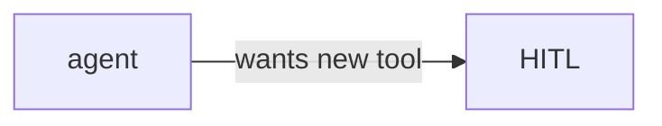

# 15: Self-evolution (module only)

After this page you know long-horizon self-change is a later judgment call, not a required lab.

## Data
- Moved from modules/04/03 if useful
- No new lab

## Information
Useful as a warning: do not let the agent rewrite its own grants without HITL.

## Knowledge
Read only.

## Wisdom
Skip if you are still on the path.

## The When and Why
- **When:** you are tempted to let the agent edit its tools.
- **Why:** that is a shield problem (chapter 09).

## How it works

## Data contract
No extra contract.

## Lab
Module only.

## Related
- **Chapter 09:** the gate.

## Notes
No Future Lab Blueprint.
