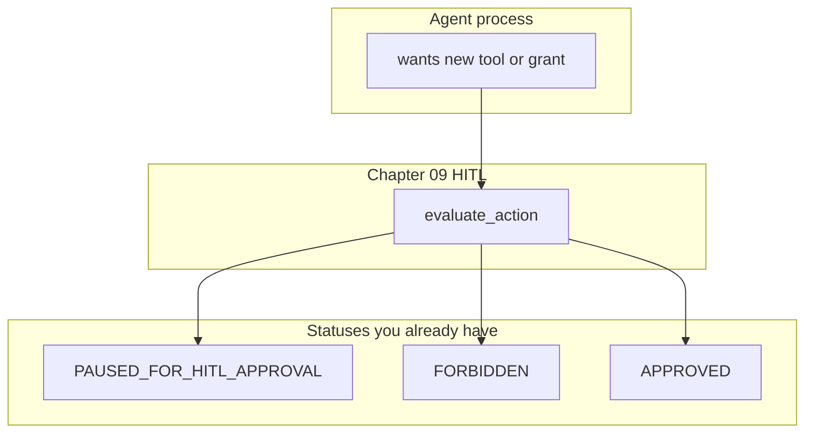

# 15: Self-evolution (module only)

After this page you know long-horizon self-change is a later judgment call, not a required lab. This page does not add a new primitive.

## Data
**Self-evolution** here means the agent wants to edit its own tools, grants, or registry: add a function, widen a permission, or rewrite `TOOL_REGISTRY` without a person in the loop.

There is no new lab and no new JSON key. The gate you already have is chapter 09 HITL (`evaluate_action` / `PAUSED_FOR_HITL_APPROVAL`). A grant change is a mutative action. It uses that same status string.

Moved from old `modules/04/03` if useful. No script was added.

`OLLAMA_HOST` should still default to `http://192.168.1.29:11434`. `OLLAMA_MODEL` should still default to `qwen3.6:35b-a3b-65k`. Those defaults do not change on this page because this page does not POST.

## Information
Useful as a warning: do not let the agent rewrite its own grants without HITL.

A new tool name in `TOOLS_SCHEMA` plus a new function in `TOOL_REGISTRY` is chapter 03. A dangerous command that must pause is chapter 09. Putting those two together is not a new science. Letting the model write both without `evaluate_action` is the failure mode this page names.

Skip this page if you are still on the required path (00–14 plus the harness overview).

## Knowledge
1. Read only. Do not write a lab.
2. If the model proposes a new tool or a wider grant, treat that string as a mutative command.
3. Call the chapter 09 gate (`evaluate_action` or the same `PAUSED_FOR_HITL_APPROVAL` status).
4. Do not add a self-edit loop, a grant file, or a Future Lab Blueprint.

## Wisdom
Do not add a new primitive; compose what you already have. Skip if you are still on the path. A self-edit loop would hide whether the miss came from the old HITL gate or from the new writer.

## The When and Why
- **When:** you are tempted to let the agent edit its tools.
- **Why:** that is a shield problem (chapter 09).

## How it works



Walkthrough of the judgment call:

1. The model (or a script) proposes a new tool name or a wider grant.
2. You do not write that into `TOOL_REGISTRY` in the same turn.
3. You send the proposal through the chapter 09 gate. A mutative change returns `PAUSED_FOR_HITL_APPROVAL`. A forbidden change returns `FORBIDDEN`.
4. A person approves or rejects. Only then does the registry change.

Nothing in that walkthrough is a new class of object. There is no lab to run.

## Data contract

No extra contract. Reuse the chapter 09 HITL payload.

```json
{
  "status": "PAUSED_FOR_HITL_APPROVAL",
  "approval_modal": {
    "type": "HITLApprovalModal",
    "proposed_command": "string",
    "risk_level": "HIGH",
    "requires_token": true
  }
}
```

There is no reference `.py` in this folder for this page.

## Lab
Module only. No lab. Do not add a new primitive.

- Module: [this file](./03_self_evolution.md)
- Gate: chapter 09 [lab4_hitl_generative_ui.py](../09_the_shield/lab4_hitl_generative_ui.py) / [lab4_hitl_generative_ui.md](../09_the_shield/lab4_hitl_generative_ui.md) and the HITL class in [lab3_enterprise_harness_app.py](./lab3_enterprise_harness_app.py).

## Related
- **Chapter 09:** the gate.
- **01_project_blueprints.md:** optional slices. This page is not one of them.

## Notes
- No Future Lab Blueprint.
- No new lab was added. Do not invent one.
- Moved from old `modules/04/03` if useful. Read-only on purpose.
