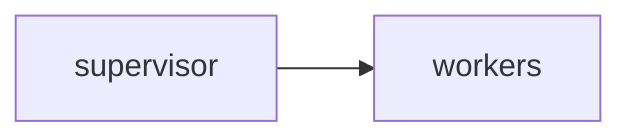

# Lab 1: Multi-agent workbench

Reference blueprint. Reuse 08.

## Data
- Script: `lab1_multi_agent_workbench.py`

## Information
See old lab notes after move.

## Knowledge
Run the reference or rewrite from the brief.

## Wisdom
Not a new topology.

## The When and Why
- **When:** you want a workbench slice.
- **Why:** pieces already exist.

## How it works



## Data contract
handoff JSON

## Run

```bash
python education/15_synthesis/lab1_multi_agent_workbench.py
```

## What you should see
A combined report.

## What this becomes later
Other blueprints.

## Related
- **Chapter 08.**

## Notes

