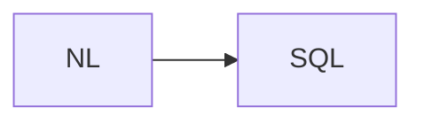

# Lab 2: Enterprise SQL agent

Reference blueprint. Structured SQL out.

## Data
- Script: `lab2_enterprise_sql_agent.py`

## Information
JSON/SQL contract from chapter 02.

## Knowledge
Run or rewrite.

## Wisdom
Not a new database product.

## The When and Why
- **When:** NL → SQL.
- **Why:** need a validated query.

## How it works



## Data contract
SQL string

## Run

```bash
python education/15_synthesis/lab2_enterprise_sql_agent.py
```

## What you should see
A SQL string.

## What this becomes later
SRE blueprint.

## Related
- **Chapter 02.**

## Notes

