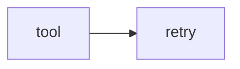

# Lab 2: Resilient executor

After this lab the harness retried a failed tool under the chapter 11 policy.

## Data
- Script: `lab2_resilient_executor.py`

## Information
Kernel + retry.

## Knowledge
1. Fail once.
2. Retry.
3. Succeed or stop.

## Wisdom
Not a new gateway.

## The When and Why
- **When:** tools flake.
- **Why:** chapter 11 isolated the retry.

## How it works



## Data contract
same as chapter 11

## Run

```bash
python education/15_synthesis/lab2_resilient_executor.py
```

## What you should see
Retry logs then a result.

## What this becomes later
Lab 3 is the full app.

## Related
- **Chapter 11 gateway.**

## Notes

