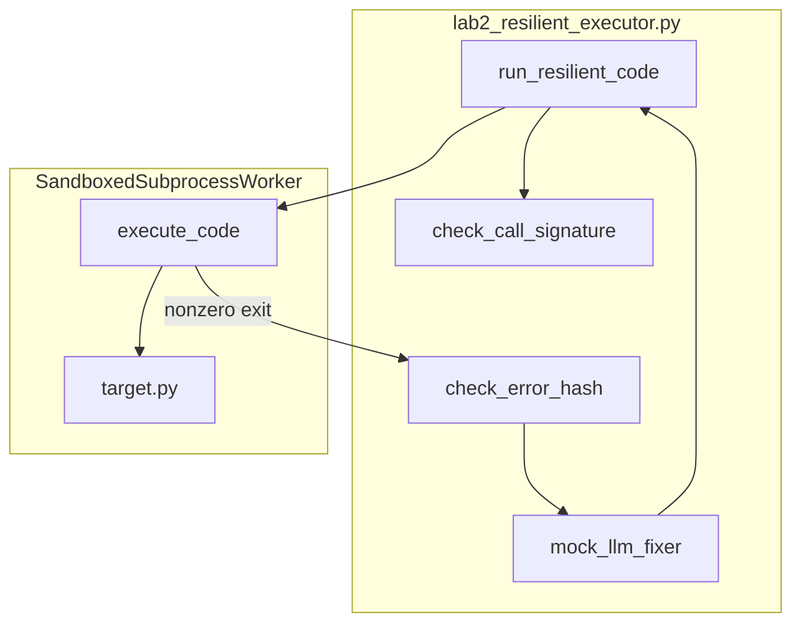

# Lab 2: Resilient executor

A failed tool run is retried under the chapter 11 policy, using the chapter 09 sandbox and the chapter 12 cycle hash. Not a new gateway.

## What you touch
- Script: `lab2_resilient_executor.py`
- Classes: `CycleOscillationDetector`, `SandboxedSubprocessWorker`, `ResilientExecutionController`
- Functions: `check_call_signature`, `check_error_hash`, `execute_code`, `run_resilient_code`, `mock_llm_fixer`
- URL / path: none in the reference script. Intended retry target is `{OLLAMA_HOST}/api/generate` (default `http://192.168.1.29:11434/api/generate`)
- Keys sent (intended, if the fixer POSTs): `model`, `prompt`, `stream` (`false`)
- Keys read (intended): `response`
- Files written: `target.py` in a `harness_sandbox_` temp dir

## Steps


1. Read `OLLAMA_HOST` and `OLLAMA_MODEL` from the environment. If they are unset, use `http://192.168.1.29:11434` and `qwen3.6:35b-a3b-65k`. The reference script does not POST.
2. Build `ResilientExecutionController`. It owns `CycleOscillationDetector(max_repeats=2)` and `SandboxedSubprocessWorker`.
3. Call `run_resilient_code` with the broken snippet `def divide():\n    return 10 / 0\nprint(divide())` and `mock_llm_fixer`.
4. On each attempt (max 3): `check_call_signature("execute_code", {"code_len": len(current_code)})`. If that signature has already been seen `max_repeats` times, return `ABORTED`.
5. `execute_code` writes `target.py` in a `harness_sandbox_` temp dir, starts `[sys.executable, target.py]`, and uses `communicate(timeout=3.0)`. Exit 0 returns `SUCCESS` with `stdout`.
6. On failure, `check_error_hash(stderr)` MD5s the traceback. A repeated hash returns `ABORTED`. Otherwise call the fixer and retry. Intended fixer is a chapter 11 retry POST. The reference fixer is `mock_llm_fixer` and returns `return 10 / 2`.

## Data contract

**Intended** (chapter 11 retry of a failed tool or POST)

```json
{
  "model": "qwen3.6:35b-a3b-65k",
  "prompt": "string",
  "stream": false
}
```

**What `run_resilient_code` actually returns on success**

```json
{
  "status": "SUCCESS",
  "attempts": 2,
  "stdout": "5",
  "final_code": "string"
}
```

**Abort / fail**

```json
{
  "status": "ABORTED",
  "reason": "string"
}
```

`status` can also be `FAILED` with `reason` `Max attempts exceeded.` There is no HTTP body. See Notes.

## Run
From the repo root:

```bash
python education/15_synthesis/lab2_resilient_executor.py
```

```powershell
$env:OLLAMA_HOST="http://192.168.1.29:11434"
$env:OLLAMA_MODEL="qwen3.6:35b-a3b-65k"
python education/15_synthesis/lab2_resilient_executor.py
```

## What you should see
`=== STARTING RESILIENT EXECUTION CONTROLLER ===`, `[ATTEMPT 1]` with `ZeroDivisionError`, `[REFLEXION]` plus an 8-char MD5 prefix, `[SELF-HEALING]`, `[ATTEMPT 2]` with `[SUCCESS]`, then a JSON payload `status` `SUCCESS`, `attempts` 2, `stdout` `5`. This script does not need Ollama. If you wire a real fixer POST later and see `URLError`, the provider is not reachable.

## Stop here
Do not add a new primitive; compose what you already have. Sandbox plus cycle plus one retry is enough. Do not add a new gateway mesh. Lab 3 in this folder (`lab3_enterprise_harness_app.py`) is the full app. A new retry stack would hide whether the miss came from the child, the hash, or the extra.

## Notes
- Kernel plus retry. Reuse chapter 09 `subprocess.Popen`, chapter 12 cycle/error hash, chapter 11 retry policy, chapter 12 reflexion.
- Contract drift vs `lab2_resilient_executor.py`: no `OLLAMA_HOST` / `OLLAMA_MODEL`, no POST, no session file, no `tool_calls`. Cycle key is `execute_code` plus `code_len` (not tool args plus result). Error halt is MD5 of `stderr`. Fixer is `mock_llm_fixer`, not a model. Temp dir prefix is `harness_sandbox_`. Script name inside the dir is `target.py`. Timeout is 3.0 seconds. The intended contract is a chapter 11 retry of a failed tool. Write that in your copy. Leave the reference file as-is.
