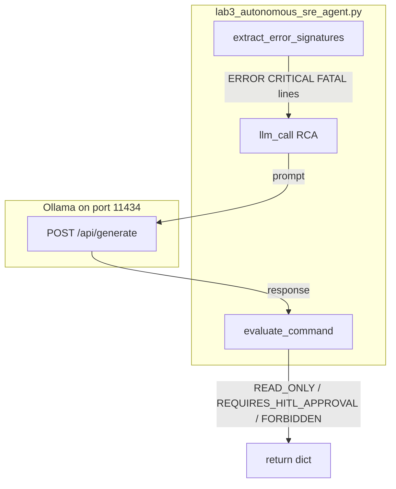

# Lab 3: Autonomous SRE agent

An alert becomes a filtered log list, a one-sentence RCA, and a HITL pause. This reuses chapter 06 phases, chapter 09 HITL, and chapter 13 filter. Not a new pager product.

## What you touch
- Script: `lab3_autonomous_sre_agent.py`
- Classes: `LogTriageEngine`, `SRECommandSafetyGuard`, `AutonomousSREAgent`
- Functions: `extract_error_signatures`, `evaluate_command`, `investigate_and_remediate`, `llm_call`
- URL / path: `{OLLAMA_HOST}/api/generate` (default `http://192.168.1.29:11434/api/generate`)
- Keys sent: `model`, `prompt`, `stream` (`false`), `options.temperature` (`0.0`)
- Keys read: `response`

## Steps


1. Read `OLLAMA_HOST` and `OLLAMA_MODEL` from the environment. If they are unset, use `http://192.168.1.29:11434` and `qwen3.6:35b-a3b-65k`.
2. Call `investigate_and_remediate` with the four sample log lines in `__main__` (one `INFO`, one `ERROR` `ConnectionPoolExhausted`, one `CRITICAL` HTTP 502, one `INFO`).
3. `extract_error_signatures` keeps lines that contain `ERROR`, `CRITICAL`, or `FATAL`.
4. `llm_call` POSTs those lines and asks for a 1-sentence root cause. Read `response`.
5. Evaluate three hardcoded commands with `evaluate_command`:
   - `kubectl get pods -n production` → `READ_ONLY`
   - `kubectl rollout restart deployment/api-gateway -n production` → `REQUIRES_HITL_APPROVAL` (whitelist regex)
   - `kubectl delete namespace production` → `FORBIDDEN`
6. Return a dict. Do not run kubectl.

## Data contract

**Intended alert**

```json
{
  "alert": "string",
  "logs": []
}
```

**Request** `POST /api/generate`

```json
{
  "model": "qwen3.6:35b-a3b-65k",
  "prompt": "string",
  "stream": false,
  "options": { "temperature": 0.0 }
}
```

**Response**

```json
{
  "response": "string"
}
```

**What `investigate_and_remediate` actually returns**

```json
{
  "status": "SUCCESS",
  "rca": "string",
  "remediation_status": "PAUSED_FOR_HITL_APPROVAL",
  "approval_modal": {
    "type": "HITLApprovalModal",
    "proposed_command": "kubectl rollout restart deployment/api-gateway -n production",
    "risk_level": "MEDIUM"
  }
}
```

The input is a list of log strings, not an alert JSON object. Commands are literals. See Notes.

## Run
From the repo root:

```bash
python education/15_synthesis/lab3_autonomous_sre_agent.py
```

```powershell
$env:OLLAMA_HOST="http://192.168.1.29:11434"
$env:OLLAMA_MODEL="qwen3.6:35b-a3b-65k"
python education/15_synthesis/lab3_autonomous_sre_agent.py
```

## What you should see
`=== STARTING AUTONOMOUS DEVOPS & SRE AGENT LAB ===`, `Extracted 2 ERROR log signatures.`, a `[ROOT CAUSE ANALYSIS]` sentence, then three guard lines: `READ_ONLY`, `REQUIRES_HITL_APPROVAL`, `FORBIDDEN`. The final payload has `remediation_status` `PAUSED_FOR_HITL_APPROVAL`. If you see `URLError` or `Connection refused`, the provider is not reachable. If you see HTTP 404, the model name is wrong.

## Stop here
Do not add a new primitive; compose what you already have. A filter plus a POST plus the chapter 09 gate is enough. Do not add a pager product, a live kubectl client, or a new DAG engine. A free loop on prod is the risk this page avoids.

## Notes
- Reference blueprint. Alarm to action. Reuse chapter 06 phases, chapter 09 HITL, chapter 13 filter.
- Contract drift vs `lab3_autonomous_sre_agent.py`: no `OLLAMA_HOST` / `OLLAMA_MODEL` read (URL and model are literals). Route is `/api/generate`. Input is a `List[str]`, not alert JSON. The three kubectl strings are hardcoded after the RCA. The whitelist regexes are lowercase and require `-n <ns>`. No command is executed. The intended contract is alert JSON plus a HITL pause. Write that in your copy. Leave the reference file as-is.
