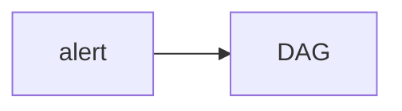

# Lab 3: Autonomous SRE agent

Reference blueprint. Alarm → action.

## Data
- Script: `lab3_autonomous_sre_agent.py`

## Information
DAG + shield.

## Knowledge
Run or rewrite.

## Wisdom
Not a new pager product.

## The When and Why
- **When:** an alert needs a scripted path.
- **Why:** a free loop is risky on prod.

## How it works



## Data contract
alert JSON

## Run

```bash
python education/15_synthesis/lab3_autonomous_sre_agent.py
```

## What you should see
A remediation stub.

## What this becomes later
Serving infra.

## Related
- **Chapter 06 + 09.**

## Notes

