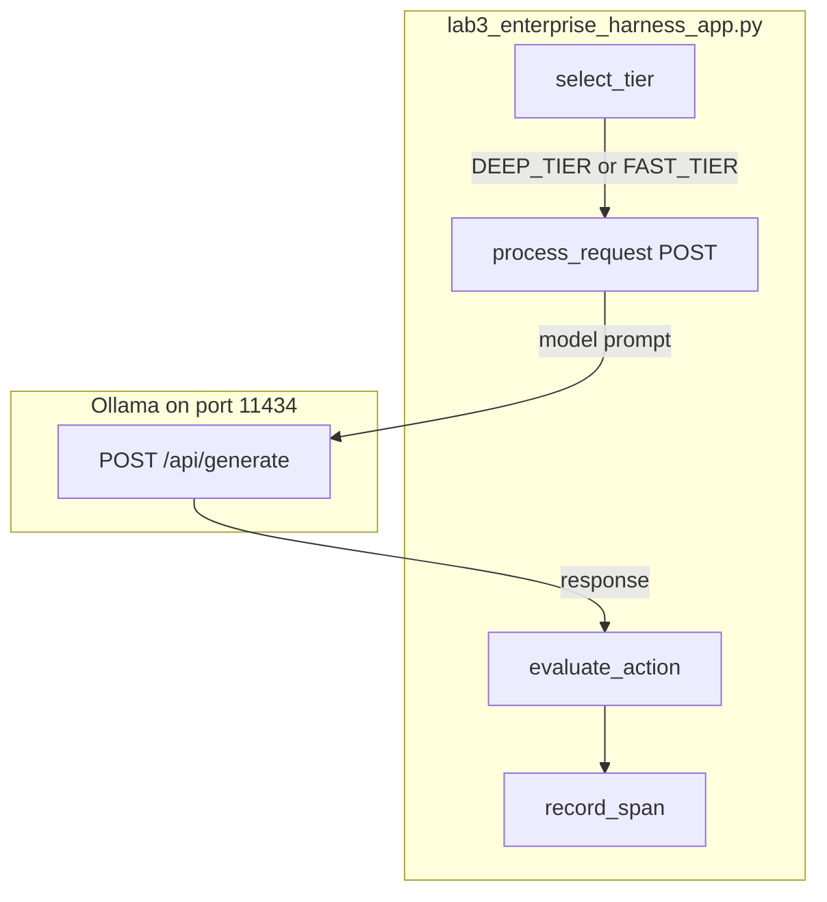

# Lab 3: Enterprise harness app

One process uses the chapter 11 router, a chapter 09 HITL gate, and a span list. Snap, do not invent. Do not add demos/.

## What you touch
- Script: `lab3_enterprise_harness_app.py`
- Classes: `MultiModelGatewayRouter`, `SDUIHITLApprovalGate`, `OTelEvalTracer`, `EnterpriseAgentAppHarness`
- Functions: `select_tier`, `evaluate_action`, `record_span`, `process_request`
- URL / path: `{OLLAMA_HOST}/api/generate` (default `http://192.168.1.29:11434/api/generate`)
- Keys sent: `model`, `prompt`, `stream` (`false`), `options.temperature` (`0.2`)
- Keys read: `response`, `prompt_eval_count`, `eval_count`

## Steps


1. Read `OLLAMA_HOST` and `OLLAMA_MODEL` from the environment. If they are unset, use `http://192.168.1.29:11434` and `qwen3.6:35b-a3b-65k`. The reference script also names `qwen2.5:7b` as `FAST_MODEL`.
2. Call `process_request("ent_session_701", "Analyze system logs and refactor database connection pool.", "kubectl rollout restart deployment/api-gateway")`.
3. `select_tier` looks for `refactor`, `analyze`, `debug`, `architect`, `synthesis`. This prompt hits `DEEP_TIER` and `qwen3.6:35b-a3b-65k`.
4. POST `model`, `prompt`, `stream: false`, `options.temperature: 0.2` to `{host}/api/generate`. Read `response`.
5. `evaluate_action` on the proposed command. `rollout restart` is mutative, so status is `PAUSED_FOR_HITL_APPROVAL`.
6. `record_span` twice: `llm.inference` and `hitl.safety_gate`. Return the dict. Intended: also load and save `state_store/{session_id}.json`. The reference script does not write a session file.

## Data contract

**Intended session JSON**

```json
{
  "session_id": "ent_session_701",
  "messages": [],
  "turn_count": 0
}
```

**Request** `POST /api/generate`

```json
{
  "model": "qwen3.6:35b-a3b-65k",
  "prompt": "string",
  "stream": false,
  "options": { "temperature": 0.2 }
}
```

**What `process_request` actually returns**

```json
{
  "status": "PAUSED_FOR_HITL_APPROVAL",
  "session_id": "ent_session_701",
  "selected_tier": "DEEP_TIER",
  "llm_response": "string",
  "safety_eval": {},
  "total_duration_ms": 0.0,
  "telemetry_spans": []
}
```

`llm_response` is the first 120 characters of `response` plus `...`. See Notes.

## Run
From the repo root:

```bash
python education/15_synthesis/lab3_enterprise_harness_app.py
```

```powershell
$env:OLLAMA_HOST="http://192.168.1.29:11434"
$env:OLLAMA_MODEL="qwen3.6:35b-a3b-65k"
python education/15_synthesis/lab3_enterprise_harness_app.py
```

## What you should see
`=== STARTING ENTERPRISE AGENT APP HARNESS: 'ent_session_701' ===`, `[ROUTER] Prompt Triage -> Selected Tier: DEEP_TIER (qwen3.6:35b-a3b-65k)`, `[SAFETY GATE] ... -> Status: PAUSED_FOR_HITL_APPROVAL`, then a JSON payload with two `telemetry_spans`. Intended: a multi-turn run that loads state. The reference script is one `process_request` call. If you see `URLError` or `Connection refused`, the provider is not reachable. If you see HTTP 404, a model name is wrong (`qwen3.6:35b-a3b-65k` or `qwen2.5:7b`).

## Stop here
Do not add a new primitive; compose what you already have. Router plus HITL plus spans is enough. Do not add a `demos/` folder or a new UI. Optional blueprints are the other labs in this folder. A new host would hide whether the miss came from the POST, the gate, or the extra.

## Notes
- Snap, do not invent. Reuse chapter 11 router, chapter 09 HITL, chapter 12 / 00 trace. Chapter 07 lab1 is the kernel this page is meant to wrap.
- Contract drift vs `lab3_enterprise_harness_app.py`: no `OLLAMA_HOST` / `OLLAMA_MODEL` read (URL and models are literals). Route is `/api/generate`, not `/api/chat`. No `messages`, no `tools`, no `state_store` write. `process_request` takes `proposed_action` from the caller. `temperature` is `0.2`. `FAST_MODEL` is `qwen2.5:7b`. `llm_response` is truncated. Spans live only in the return dict. The intended contract is session JSON plus one shield plus one reliability piece. Write that in your copy. Leave the reference file as-is.
