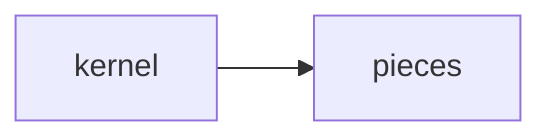

# Lab 3: Enterprise harness app

After this lab one process used kernel + at least one shield + one reliability piece.

## Data
- Script: `lab3_enterprise_harness_app.py`

## Information
Snap, do not invent.

## Knowledge
1. Run the script.
2. Note which pieces it calls.

## Wisdom
Do not add demos/.

## The When and Why
- **When:** the path is done.
- **Why:** a single file should reuse, not rewrite.

## How it works



## Data contract
session JSON

## Run

```bash
python education/15_synthesis/lab3_enterprise_harness_app.py
```

## What you should see
A multi-turn run that loads state.

## What this becomes later
Optional blueprints next.

## Related
- **Chapter 07 lab1.**

## Notes

