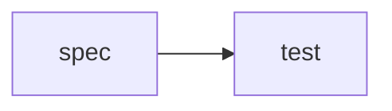

# Lab 3: Spec TDD loop

After this lab a failing spec became a passing check.

## Data
- Script: `lab3_spec_tdd_loop.py`

## Information
Red then green.

## Knowledge
1. Fail.
2. Write.
3. Pass.

## Wisdom
Not a new agent.

## The When and Why
- **When:** you have a spec.
- **Why:** code-first skips it.

## How it works



## Data contract
spec text

## Run

```bash
python education/15_synthesis/lab3_spec_tdd_loop.py
```

## What you should see
Fail then pass.

## What this becomes later
Harness can wrap this.

## Related
- **Chapter 12 evals.**

## Notes

