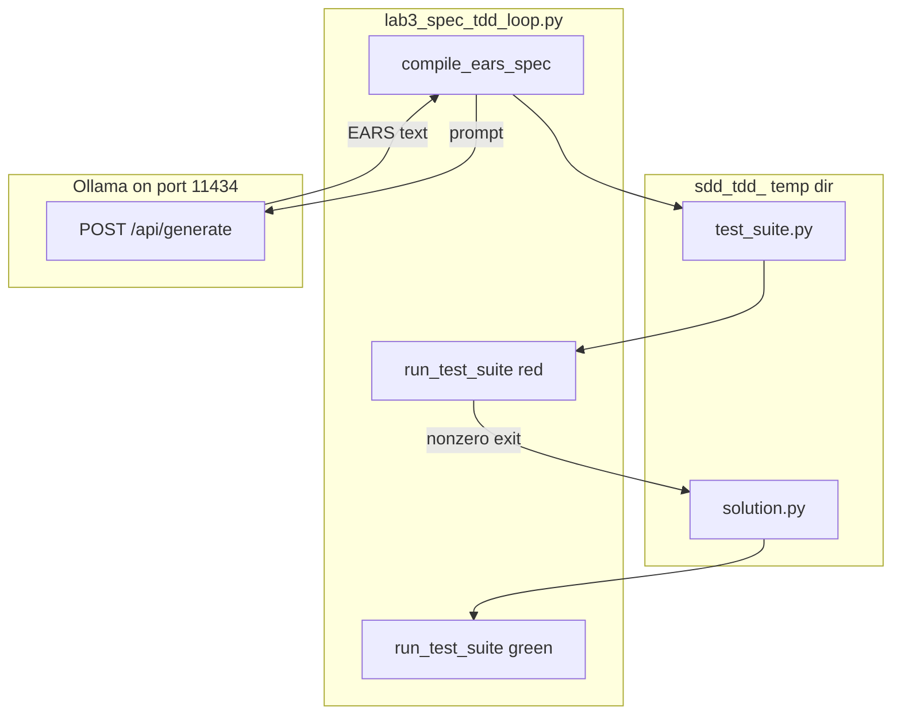

# Lab 3: Spec TDD loop

A failing spec becomes a passing check. This reuses chapter 02 structured text, the chapter 09 sandbox, and chapter 12 evals (the score is the exit code). Not a new agent.

## What you touch
- Script: `lab3_spec_tdd_loop.py`
- Functions: `compile_ears_spec`, `run_test_suite`, `run_spec_tdd_pipeline`, `llm_call`
- URL / path: `{OLLAMA_HOST}/api/generate` (default `http://192.168.1.29:11434/api/generate`)
- Keys sent: `model`, `prompt`, `stream` (`false`), `options.temperature` (`0.0`)
- Keys read: `response`
- Files written: `test_suite.py`, `solution.py` in a `sdd_tdd_` temp dir

## Steps


1. Read `OLLAMA_HOST` and `OLLAMA_MODEL` from the environment. If they are unset, use `http://192.168.1.29:11434` and `qwen3.6:35b-a3b-65k`.
2. Call `run_spec_tdd_pipeline` with `Create a multiply function that takes two numbers and returns their product.`
3. `compile_ears_spec` POSTs that goal and asks for two EARS lines (`WHEN [trigger], the system SHALL [action].`). Print the `response`.
4. Write `test_suite.py` (`TestMultiply.test_positive` asserts `multiply(4, 5) == 20`) and a dummy `solution.py` (`def multiply(a, b): return 0`).
5. `run_test_suite` starts `[sys.executable, test_suite.py]` with `communicate(timeout=10)`. Exit must be nonzero. That is red.
6. Overwrite `solution.py` with `def multiply(a, b): return a * b`. Re-run. Exit must be 0. That is green.

## Data contract

**Intended spec** (markdown or JSON assertions, or EARS lines)

```text
WHEN two numbers are passed, the system SHALL return their product.
```

**Request** `POST /api/generate`

```json
{
  "model": "qwen3.6:35b-a3b-65k",
  "prompt": "string",
  "stream": false,
  "options": { "temperature": 0.0 }
}
```

**Response**

```json
{
  "response": "string"
}
```

**Test exits**

```json
{
  "red_exit_code": 1,
  "green_exit_code": 0
}
```

`run_test_suite` returns one int. The pipeline prints both. The red and green files are literals in the reference script. See Notes.

## Run
From the repo root:

```bash
python education/15_synthesis/lab3_spec_tdd_loop.py
```

```powershell
$env:OLLAMA_HOST="http://192.168.1.29:11434"
$env:OLLAMA_MODEL="qwen3.6:35b-a3b-65k"
python education/15_synthesis/lab3_spec_tdd_loop.py
```

## What you should see
`=== STARTING SPEC-DRIVEN DEVELOPMENT (SDD) & TDD ENGINE ===`, `[EARS SPEC GENERATED]` plus two SHALL lines, `[TDD RED STEP]` with a nonzero exit, `[TDD GREEN STEP]` with exit 0, then `=== SDD & TDD EXECUTION SUCCESSFUL ===`. If you see `URLError` or `Connection refused`, the provider is not reachable. If you see HTTP 404, the model name is wrong. A green fail means `solution.py` was not overwritten or the test file is wrong.

## Stop here
Do not add a new primitive; compose what you already have. A spec plus a failing test plus a child-process re-run is enough. Do not add a new agent or a PR bot. The harness can wrap this later. A new writer would hide whether the miss came from the spec, the test, or the extra.

## Notes
- Red then green. Reuse chapter 02, chapter 09 sandbox, chapter 12 evals.
- Contract drift vs `lab3_spec_tdd_loop.py`: no `OLLAMA_HOST` / `OLLAMA_MODEL` read (URL and model are literals). Route is `/api/generate`. Only the EARS spec is model output. `test_suite.py` and both versions of `solution.py` are hardcoded. No session JSON. No `tool_calls`. Temp dir prefix is `sdd_tdd_`. Timeout is 10 seconds. The intended contract is spec text that drives a failing test then a fix. Write that in your copy. Leave the reference file as-is.
